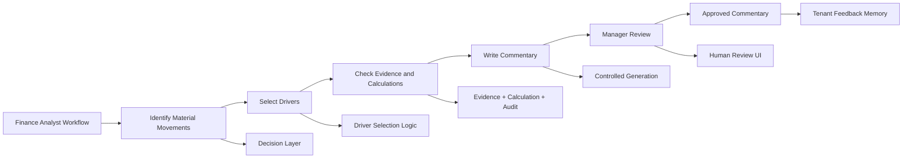
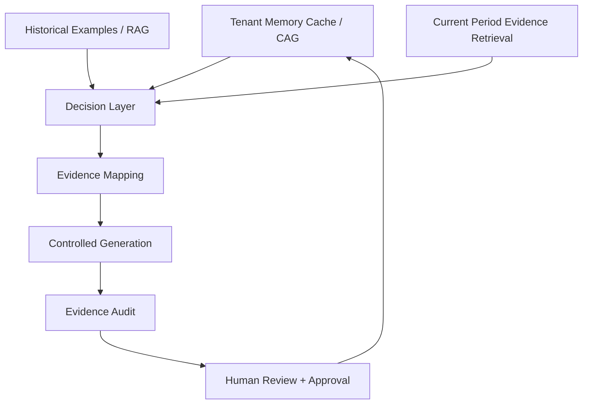
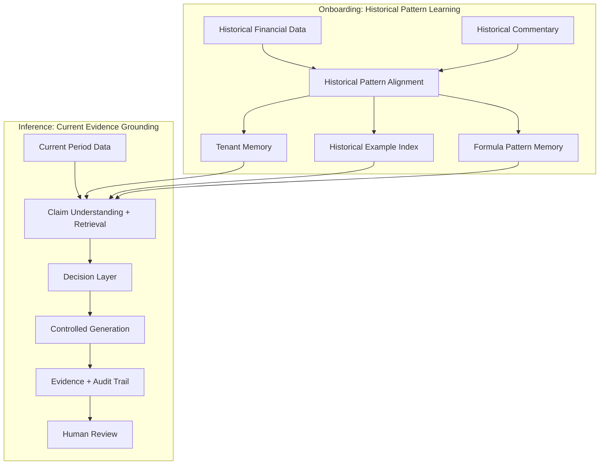
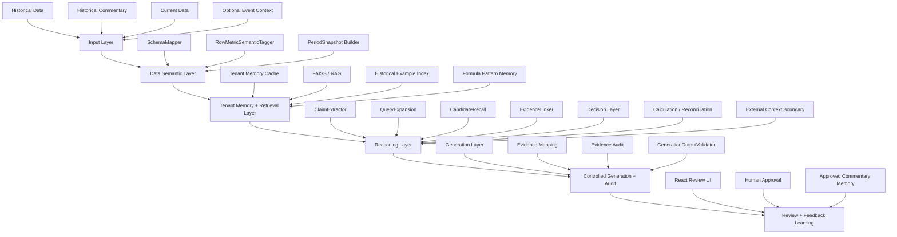
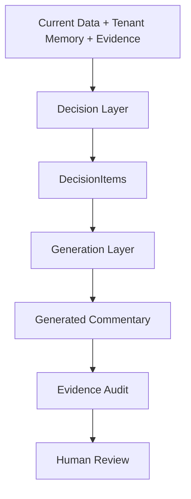
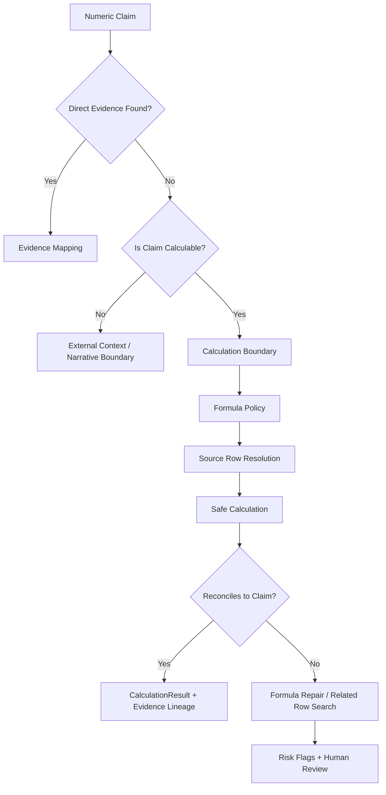
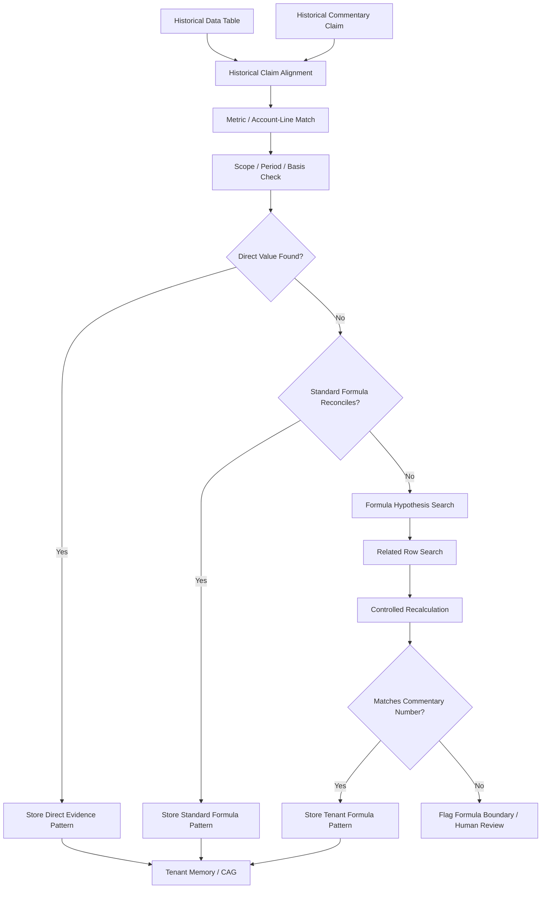
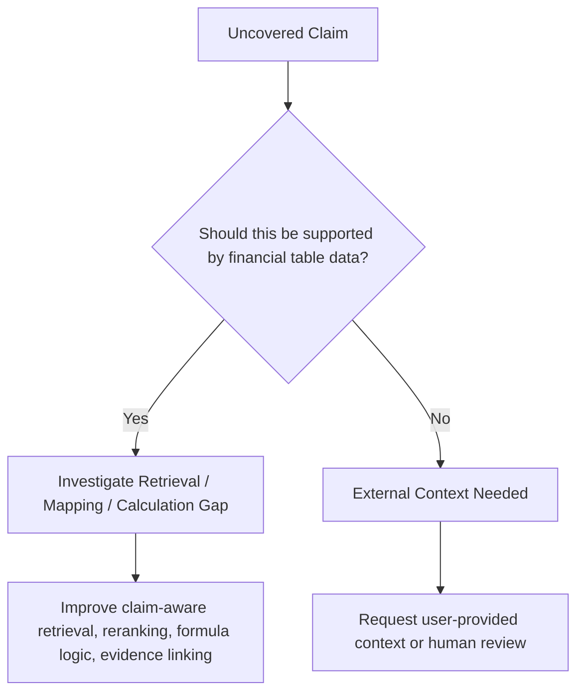
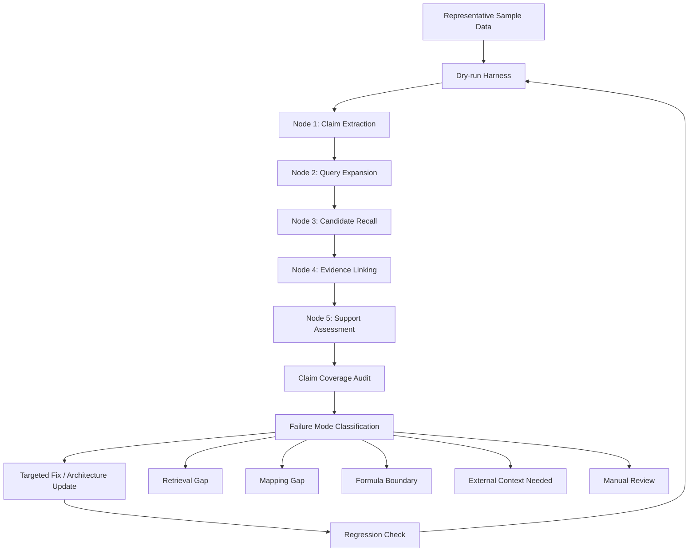
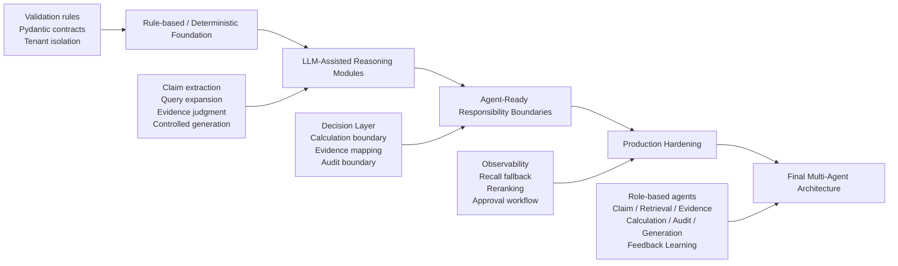

# FCA — Financial Commentary Autogeneration System

### An AI Engineering Case Study for Evidence-Grounded FP&A Commentary

**FCA** is a tenant-aware, evidence-grounded AI engineering project that explores how recurring FP&A performance commentary can be turned into a reviewable AI analyst workflow. Commentary is the visible output; the engineering focus is the recurring performance explanation workflow behind it: deciding what changed, what is material, what evidence supports it, what requires calculation, and what needs human review.

Instead of treating commentary as a one-shot text-generation task, this project focuses on boundary-aware AI system design: identifying material movements, selecting drivers, grounding claims in evidence, handling calculation boundaries, learning tenant-specific formulas, and producing commentary that can be reviewed, audited, and improved through feedback.

> **Core idea:** The system should behave like a reviewable financial analyst workflow: evidence-backed, calculation-aware, standard-compliant, and human-reviewable.


---

## 1. Project Overview

Finance / FP&A teams repeatedly produce monthly or quarterly commentary to explain actuals versus budget, prior-period movement, forecast changes, business drivers, and exceptions that require management attention.

The workflow looks repetitive on the surface, but the hard part is not simply writing faster. FP&A commentary is a standardized communication and review layer between analysts, managers, executives, and downstream readers. Each reporting cycle requires analysts to decide what changed, whether the movement is material enough to call out, which account / LOB / department / vendor / business dimension drove the movement, whether the numbers reconcile, and how the explanation should be phrased according to the team's reporting standard.

A useful AI system for this workflow therefore cannot be a simple text-generation layer. It needs to help with:

- deciding which movements are material enough to mention;
- selecting drivers across flexible business dimensions such as account, LOB, department, vendor, region, or other tenant-specific dimensions;
- preserving consistent team language, recurring structure, and shared metric definitions;
- understanding company-specific formula conventions, basis rules, and scope definitions;
- grounding financial claims in the right rows, periods, scopes, units, and bases;
- checking whether numbers, calculations, and reconciliations make sense before review;
- distinguishing table-supported claims from event-driven or management-context claims;
- showing source evidence, calculation lineage, support status, confidence, and risk flags;
- learning from approved edits without bypassing governance or audit boundaries.

FCA decomposes the workflow into separate responsibilities: tenant memory, dynamic retrieval, structured claim understanding, evidence grounding, calculation/reconciliation, controlled generation, quality evaluation, and human review.

A central design insight is that finance commentary patterns function as a team's operating standard: callout rules, materiality thresholds, driver-selection logic, metric definitions, formulas, preferred phrasing, reviewer expectations, and approval patterns.

---

## 2. Why This Problem Matters

Many AI writing tools can generate a paragraph that looks like financial commentary. In a real finance workflow, the harder question is whether an AI system can decide what is worth saying, ground each material financial claim in evidence, flag unsupported or calculation-boundary statements, distinguish table-supported claims from external-context claims, and produce reviewable artifacts for human oversight.

FCA is designed around that system-level challenge.

### Key pain points in current finance commentary workflows

| Pain Point | Why It Matters | FCA Design Response |
|---|---|---|
| Recurring commentary is a high-review-cost workflow | Analysts repeat similar reporting cycles, but each cycle still requires detailed judgment, data checks, and manager review | Turn commentary generation into a structured, evidence-backed workflow rather than a free-form writing task |
| Teams need standardized reporting language | Consistent structure and terminology help reviewers, managers, and readers understand recurring metrics quickly | Learn and preserve tenant-specific reporting standards beyond writing style |
| Driver selection is judgment-heavy | A large movement is not always the right story, and a smaller movement may matter if it explains the business narrative | Separate Decision Layer from Generation Layer so the system reasons about what to say before writing |
| Financial numbers require validation and reconciliation | Teams often validate key numbers manually, but full coverage is time-consuming and error-prone | Check source evidence, calculation lineage, scope/basis alignment, and reconciliation status before review |
| Financial definitions can be tenant-specific | Teams may use company-specific formulas, basis conventions, or scope definitions that generic models do not know | Learn validated formula patterns and preserve formula memory with reconciliation checks |
| Some explanations are not in the table | Special events, management narrative, and macro context cannot always be proven from the financial table alone | Distinguish table-supported claims from external-context-needed claims and route them to human review |
| Generic AI summaries can miss the last-mile workflow | Existing summaries may explain variance faster, but may not enforce reporting standards, evidence support, calculation checks, or approval feedback learning | Produce reviewable commentary artifacts with source evidence, calculation trace, support status, risk flags, and feedback memory |

### Why this workflow is now technically feasible

This workflow has historically been hard to operationalize or automate because financial exports vary by company, commentary rules are often implicit, and judgment is distributed across Excel logic, analyst experience, SOPs, and reviewer preferences. Modern LLMs, retrieval systems, structured outputs, and human-in-the-loop workflows make it more feasible to connect messy tables, historical commentary, evidence grounding, calculation checks, and reviewable generation into one controlled system.

## 3. System Goal

FCA is structured as an **AI-assisted financial analyst workflow**, not as a generic chatbot.

The goal of the project is to show how a recurring FP&A performance explanation workflow can be decomposed into technical components that are evidence-grounded, reviewable, and safe to iterate.

The target workflow is organized around the following inputs:

- historical financial data;
- historical commentary;
- current-period financial data;
- optional business or event context;
- finalized user edits and approval feedback.

The system then produces FP&A-style commentary with:

- selected evidence rows;
- claim-to-evidence mapping;
- driver-selection rationale;
- calculation lineage if derived metrics are used;
- reconciliation / support status;
- confidence and risk flags;
- audit status;
- human-review-friendly outputs;
- feedback learning for future periods.

The broader system goal is to preserve and enforce tenant-specific reporting standards while making each important commentary statement easier to review.

## 4. From FP&A Workflow to AI System

FCA starts from a real analyst workflow and converts it into a structured AI system.



The central design principle is:

> **Generation Layer = how to say it.**  
> **Decision Layer = what to say and why.**

---

## 5. Why FCA Is Not Generic RAG

A simple RAG system retrieves historical examples and asks an LLM to write a new paragraph. FCA uses retrieval differently: historical examples support tenant pattern learning, while current-period evidence is used to ground and audit specific commentary claims.

The stronger comparison is:

| Generic AI Summary | FCA Reviewable Output |
|---|---|
| Produces a fluent explanation | Shows the key commentary statement plus source evidence |
| May summarize variance at a high level | Links statements to rows, periods, units, scope, and basis |
| May not expose why a claim is supported | Shows calculation trace, support status, and risk flags |
| May not preserve team-specific standards | Uses tenant memory for reporting standards, terminology, formulas, and approval patterns |
| Usually stops at text output | Supports human review, approval, and feedback learning |

FCA separates:

- stable tenant memory from dynamic evidence retrieval;
- historical pattern learning from current-period evidence grounding;
- claim understanding from candidate retrieval;
- evidence selection from final evidence audit;
- calculation reasoning from prose generation;
- reporting-standard memory from one-off writing style;
- workflow orchestration from UI display.



### CAG-enhanced RAG positioning

FCA is best described as:

> **Tenant Memory Cache + Dynamic Evidence Retrieval + Auditable Claim-Grounded Generation**

- **CAG / Tenant Memory Cache** stores stable tenant knowledge: reporting standards, style, glossary, commentary patterns, materiality preferences, calculation/audit policies, learned formulas, reviewer preferences, approval patterns, and known caveats.
- **RAG / Retrieval** retrieves dynamic historical examples and current-period evidence candidates.
- **Evidence Mapping and Audit** ensure that generated commentary is grounded and reviewable.
- **Decision Layer** determines what should be discussed before generation.

Existing FP&A copilots, BI tools, or EPM narrative features may already help users summarize or read data faster. FCA focuses on what happens after a variance is summarized: enforcing commentary standards, linking statements to evidence, checking calculation support, flagging unsupported claims, and capturing approved feedback.

## 6. Onboarding vs Inference

FCA separates historical learning from current-period grounding.

### Onboarding Phase

Input:

- historical financial data;
- historical commentary.

Goal:

- learn how the tenant historically writes commentary;
- learn which metrics and drivers are usually discussed;
- learn materiality patterns, grouping patterns, ordering habits, and phrasing style;
- identify formulas or calculation conventions that explain historical commentary numbers;
- build tenant memory and historical example index.

Onboarding is **not** meant to be perfect final audit for every historical sentence. It is historical pattern learning and weak historical alignment.

### Inference Phase

Input:

- current-period data;
- tenant memory;
- retrieved historical examples;
- optional confirmed current-period event context.

Goal:

- understand current-period data;
- decide what should be written;
- retrieve and select current-period evidence;
- calculate or flag derived metrics when needed;
- apply learned tenant formula patterns when appropriate;
- generate commentary;
- produce evidence and audit artifacts for human review.



---

### Tenant-isolated reporting memory

The moat of this approach is not cross-tenant data mixing. Each tenant's memory should remain isolated and should be built only from that team's authorized historical data, commentary, formulas, evidence history, review decisions, and approved edits. Over time, this creates tenant-specific reporting memory around how the team explains performance.


## 7. System Architecture

FCA uses a layered architecture to preserve responsibility boundaries.



---

## 8. AI Boundary Design

A central theme of FCA is **knowing where AI helps and where AI must be constrained**.

LLMs are useful for:

- semantic understanding;
- claim extraction;
- retrieval query expansion;
- candidate evidence judgment;
- formula hypothesis generation;
- structured generation;
- reasoning assistance.

But FCA does **not** allow the LLM to freely:

- invent financial numbers;
- treat unsupported claims as supported;
- execute unvalidated formulas;
- bypass calculation policy;
- introduce unconfirmed event explanations;
- decide all commentary logic inside a single generation prompt.

### Boundary examples

| Boundary | AI Can Help With | AI Must Not Do Freely | FCA Control Mechanism |
|---|---|---|---|
| Evidence | Understand claims and judge candidates | Fabricate support | EvidenceLinker + EvidenceAudit |
| Calculation | Identify possible calculation need or propose candidate formulas | Invent formulas or values without validation | Formula policy + deterministic evaluator + reconciliation |
| Business context | Detect when external context may be needed | Make up macro or management explanations | Event context boundary + human review |
| Generation | Write in tenant style | Decide unsupported claims | DecisionItems + EvidenceRecords + validator |
| Feedback | Learn from approved edits | Override audit rules | Approved commentary memory with governance |

---

## 9. Claim-Grounded Evidence Pipeline

Financial commentary bullets often contain multiple claims. A single bullet may include a current value, a variance, a ratio, a driver, and a contextual explanation.

FCA therefore decomposes commentary into claims before evidence selection.


Example:

```text
Bullet: "Net charge-offs were $1.1B, down $412MM year-over-year, driven by Card."

Extracted claims:
1. Current value claim: Net charge-offs = $1.1B
2. Variance claim: down $412MM year-over-year
3. Driver claim: driven by Card

Evidence mapping:
- Claim 1 → Net charge-offs current-period row
- Claim 2 → Same row via derived year-over-year delta
- Claim 3 → Card-related driver evidence row or flagged if unsupported
```

This prevents the system from treating a multi-claim financial statement as one fuzzy text-matching problem.

---

## 10. Evidence Recall and Re-ranking

One of the key system challenges in FCA is that evidence grounding can fail before the EvidenceLinker even runs.

In an early pipeline design, the system expanded retrieval queries before decomposing commentary into structured claims. The retrieval stage then selected a top-50 candidate pool for downstream evidence linking.

This created a practical failure mode: the correct evidence row was sometimes not included in the top-50 candidates. Once that happened, the EvidenceLinker had no opportunity to select the right support, even if its reasoning was correct.

FCA addressed this by moving claim extraction earlier in the pipeline:

```text
Before:
QueryExpansion → CandidateRecall(top-50) → Claim Extraction / Evidence Linking

After:
ClaimExtractor → Claim-aware QueryExpansion → CandidateRecall(top-50) → EvidenceLinker
```

This made retrieval more targeted because each query was grounded in a structured claim rather than a broad commentary paragraph.

However, top-50 recall can still miss relevant rows when financial terminology is ambiguous, scope differs across rows, or a claim requires derived calculation. For production hardening, FCA is designed to support a wider candidate recall stage followed by second-pass re-ranking:

```text
Claim-aware QueryExpansion
→ CandidateRecall(top-200)
→ Re-ranking / second-pass selection
→ EvidenceLinker
→ EvidenceAudit
```

This follows a common retrieval-system pattern: use a broader recall stage to avoid missing relevant evidence, then apply a more expensive ranking or reasoning step to select the best support.

The lesson is that evidence grounding depends on **recall, ranking, support validation, and audit**, not generation quality alone.

---

## 11. Decision Layer vs Generation Layer

FCA deliberately separates reasoning from writing.

### Decision Layer

Responsible for:

- deciding what should be discussed;
- selecting material drivers;
- deciding what should be omitted;
- referencing historical tenant patterns;
- checking support level and risk flags;
- deciding whether calculation or external context is needed;
- producing structured `DecisionItems`.

### Generation Layer

Responsible for:

- writing commentary in tenant style;
- following structured DecisionItems;
- using linked EvidenceRecords and CalculationResults;
- avoiding unsupported claims;
- returning structured output for validation.



---

## 12. Calculation and Reconciliation Design

Some commentary claims cannot be supported by a single table row.

Examples:

- variance amounts;
- ratio metrics;
- component contribution;
- multi-row aggregation;
- tenant-specific formula conventions;
- period basis differences;
- annualized vs quarterly calculations.

FCA is designed to avoid misclassifying these cases as unsupported narrative claims.



### MVP approach

FCA starts with a controlled foundation:

- pre-compute common deterministic variants such as standard period-over-period deltas;
- preserve calculation lineage and risk flags;
- classify multi-row or formula-repair cases as calculation capability boundaries;
- avoid pretending that every uncovered numeric claim is a true evidence failure.

This is not a limitation of the project scope. It is a deliberate staged approach: first make standard calculations reliable and auditable, then expand into controlled formula repair once boundaries and validation logic are clear.

### Final architecture direction

Calculation / formula repair is one future agent-ready role, not the only planned agentic capability. In the final architecture, this role should support:

- controlled formula repair;
- related-row search;
- reconciliation against known totals;
- alternative formula checks;
- confidence scoring;
- human-review-friendly calculation lineage.

---

## 13. Tenant-Specific Formula Learning

A major challenge in financial commentary is that some numbers are not simple table lookups or standard variances.

For example, a commentary claim may refer to a value that looks like a period-over-period change, but the actual reporting logic may depend on multiple related rows, such as a balance movement plus a related commitment component. In these cases, a simple `current period minus prior period` rule may not reconcile to the number mentioned in the commentary.

FCA treats this as a **formula-learning and reconciliation problem**, not a generation problem.

During onboarding, the system has access to both historical financial tables and historical commentary. That creates an opportunity to ask:

> What combination of available data rows, period references, scope, basis, and calculation logic can explain the number that analysts historically wrote?

The goal is to learn tenant-specific formula patterns and preserve them in tenant memory.

### Three-way support check

When FCA tries to determine whether a claim is supported, it should not rely on text similarity alone. A strong support match should satisfy three dimensions:

| Support Dimension | What It Checks | Example |
|---|---|---|
| Metric / account-line alignment | The evidence row refers to the right business metric or account line | The row represents allowance, charge-offs, revenue, expenses, etc. |
| Numeric reconciliation | The stated number can be directly found or deterministically calculated | Current value, variance, ratio, component sum, or learned formula result matches the claim |
| Scope / period / basis alignment | The evidence uses the same reporting scope, period reference, unit, and basis | Firmwide vs LOB, reported vs managed, current quarter vs YTD, millions vs percentages |

This turns onboarding into a practical pattern-learning loop: FCA can test candidate formulas against historical commentary and keep the formulas that reconcile across the right metric, number, and reporting context.



### Why this matters

This allows FCA to distinguish between:

| Case | Example | System Response |
|---|---|---|
| Direct evidence | The number appears in the table | Link evidence row |
| Standard derived evidence | Simple variance, ratio, or component calculation reconciles | Store calculation lineage |
| Tenant-specific formula | Standard formula fails, but related rows can explain the number | Store learned formula pattern after reconciliation |
| Formula boundary | No validated formula reconciles | Flag as calculation-boundary / human review |
| External event context | Explanation depends on event or management narrative | Do not force numeric evidence; request context |

### System framing

This capability should not be framed as a separate add-on called “validation.” It is part of FCA’s core trust layer.

FCA naturally checks whether commentary claims, source evidence, and underlying calculations reconcile before analyst review.

> FCA checks whether the numbers behind the commentary make sense before they become part of a reviewable explanation.

---

## 14. Special Events vs Table-Supported Claims

Not every commentary claim is supposed to be supported by a financial data table.

During evaluation, FCA separates uncovered claims into at least two different categories:

1. **Table-supported but missed**  
   The supporting row or derivation exists in the uploaded data, but retrieval, calculation, or evidence linking failed to select it.

2. **External-context-dependent**  
   The claim depends on special events, macro context, management explanation, business narrative, or information not present in the data table.

This distinction is critical. FCA should improve retrieval and calculation for the first category, but should not hallucinate support for the second category.



This evaluation approach prevents the system from treating all uncovered claims as the same type of failure.

---

## 15. Evidence Mapping and Audit Trail

FCA’s output should not be only a paragraph. It should be a reviewable artifact.

A generated commentary bullet should be linked to:

- claims;
- selected evidence rows;
- support status;
- match basis;
- calculation results if applicable;
- risk flags;
- audit status.

Example sanitized audit trace:

A useful evidence record should make the support basis explicit instead of storing only a row ID. In FCA, support quality is judged across metric alignment, numeric reconciliation, and scope / period / basis consistency.

| Claim | Evidence | Match Basis | Support Status | Risk Flag |
|---|---|---|---|---|
| Net charge-offs were $1.1B | Net charge-offs row | current_period_value | Covered | None |
| Down $412MM YoY | Net charge-offs row | derived_delta_match | Covered | None |
| Driven by Card | Card Services row | driver_component_match | Covered / Review | Scope check |
| Due to macro outlook | N/A | external_context_needed | Not covered | Event context required |

---

## 16. Demo Walkthrough

The demo walkthrough is designed to illustrate the end-to-end FCA workflow: current-period data ingestion, evidence-grounded commentary generation, evidence and risk review, human edits, and final approval.


### Key demo artifacts

- sanitized financial input preview;
- generated commentary card;
- evidence and audit table;
- confidence / risk flag panel;
- human review / approval mockup.

---

## 17. Evaluation and Claim Coverage Audit

FCA should not be evaluated only by whether the generated text sounds fluent.

The system should evaluate whether commentary claims are:

- directly covered by evidence;
- covered through derived delta or calculation;
- supported by learned tenant-specific formulas;
- calculation-boundary cases;
- external-context-needed cases;
- unsupported due to retrieval or mapping failure;
- ambiguous and requiring manual review.

Example evaluation summary:

| Category | Meaning | Example Action |
|---|---|---|
| Covered | Claim has valid direct evidence | Accept or review |
| Derived Coverage | Claim is supported through deterministic calculation | Show calculation lineage |
| Learned Formula Coverage | Claim is supported by a validated tenant-specific formula | Show formula pattern and reconciliation |
| Calculation Boundary | Claim likely needs formula repair or aggregation | Defer to CalculationAgent / human review |
| External Context Needed | Claim requires business/event context | Request user confirmation |
| Retrieval Gap | Correct evidence not retrieved | Improve retrieval/query expansion/reranking |
| Mapping Gap | Evidence exists but was not attached | Fix EvidenceLinker / SupportAssessment |
| Manual Review | Ambiguous or low-confidence | Human reviewer decision |

This evaluation style reflects a boundary-aware AI system: the goal is not to force every claim to be covered, but to classify why each claim is or is not supportable. It also creates a natural finance-grade trust layer: if FCA is already checking claims, evidence rows, and calculations, it can surface data inconsistencies, scope/basis risks, and formula gaps before those numbers become management commentary.

### Sample-driven debugging workflow

FCA improves through sample-driven investigation:

1. select representative commentary samples;
2. extract claims;
3. check whether each claim is covered;
4. verify whether covered claims are correctly supported;
5. classify uncovered claims as retrieval gap, mapping gap, calculation boundary, learned-formula candidate, external-context-needed, or manual-review-needed;
6. update retrieval, evidence linking, calculation, or system boundary logic accordingly.

This mirrors how production AI systems are improved: not by only optimizing one aggregate metric, but by repeatedly inspecting failure modes and turning them into clearer architecture boundaries.

---

## 18. Quality Harness

FCA is designed with a quality harness around the core pipeline.

The harness is not the core pipeline logic itself. It is a repeatable debugging, evaluation, and hardening workflow that helps the system improve without turning the main pipeline into a black box or a collection of sample-specific patches.

In practice, FCA is evaluated through intermediate artifacts as well as final commentary output. The system can inspect whether claim extraction, query expansion, candidate recall, evidence linking, support assessment, calculation, and audit each behaved correctly.

| Harness Component | Purpose | Example Output |
|---|---|---|
| Dry-run harness | Runs representative sample data through onboarding / inference paths | Run summary, generated artifacts, failure notes |
| Node-based debug artifacts | Captures intermediate outputs from key pipeline nodes | Claim extraction output, query expansion output, top-k candidates, evidence links |
| Claim coverage audit | Classifies each claim by support status and failure mode | Covered, derived coverage, learned formula coverage, retrieval gap, mapping gap, external-context-needed |
| Calculation / formula inspection | Tests whether direct values or calculated formulas reconcile to commentary claims | Formula candidates, source rows, reconciliation status, risk flags |
| Smoke tests | Confirms provider integration and core contracts still work | Real-provider smoke output, contract validation logs |
| Regression checks | Prevents previously fixed retrieval, mapping, or formula failures from returning | Sample-level comparison across iterations |

This harness makes FCA easier to debug and safer to evolve. Instead of asking only whether the final commentary looks good, FCA asks where each claim succeeded or failed and why.

For example, if a numeric claim is uncovered, the harness helps determine whether:

1. the claim was extracted incorrectly;
2. query expansion failed to include the right financial terms;
3. the correct row was absent from the top-k candidate pool;
4. the correct row was retrieved but not selected;
5. the evidence was selected but support assessment failed;
6. the claim requires calculation, formula repair, or related-row search;
7. the claim requires external business context and should not be forced into table evidence.

This supports the broader implementation strategy: start with a controlled, observable MVP, then introduce stronger retrieval fallback, re-ranking, formula learning, calculation repair, and multi-agent orchestration only after the failure modes are understood.



---

## 19. Technical Stack

Planned / implemented stack areas include:

| Layer | Technologies / Concepts |
|---|---|
| Backend | Python, FastAPI, Pydantic |
| Retrieval | FAISS, embeddings, tenant-isolated vector stores, claim-aware retrieval, future reranking |
| LLM Orchestration | role-based LLM routing, structured outputs, controlled prompts |
| Data Processing | financial table normalization, schema mapping, period snapshots |
| Reasoning Modules | ClaimExtractor, QueryExpansion, CandidateRecall, EvidenceLinker, Decision Layer |
| Calculation | deterministic calculation variants, formula policy, future CalculationAgent |
| Generation | controlled generation prompt, structured output validation |
| Frontend | React demo UI |
| Evaluation / Quality Harness | dry-run harness, node-based debug artifacts, claim coverage audit, sample-driven debugging, smoke tests, regression checks |
| Memory | tenant memory cache, historical example index, formula pattern memory |
| Future Architecture | multi-agent workflow, LangGraph or equivalent orchestration |

---

## 20. Progressive Implementation Strategy

FCA is intentionally designed as a staged implementation path rather than an agent-heavy system from day one.

The initial implementation focuses on building a reliable, reviewable foundation first: clear module boundaries, deterministic guardrails, structured contracts, evidence artifacts, claim coverage diagnostics, and human-review-friendly outputs.

This is a deliberate engineering choice. In enterprise AI workflows, especially finance workflows, adding agents too early can hide responsibility boundaries and make errors harder to debug. FCA therefore starts with a controlled, modular MVP and evolves toward multi-agent orchestration only after the system has established which responsibilities should remain deterministic, which should be LLM-assisted, and which are mature enough to become agents.



This staged approach demonstrates a key engineering principle:

> Move fast enough to ship a useful AI workflow, but not so fast that the system becomes an unreviewable black box.

### Future Agent-Ready Roles

FCA's future agent architecture is **role-based, not module-name-based**. The goal is not to convert every component into an agent. The goal is to identify which responsibilities require iterative reasoning, tool use, fallback, repair, or independent verification.

Some roles may remain deterministic tools. Some may stay as LLM-assisted functions. Some may evolve into standalone agents under a future orchestrator.

| Agent-Ready Role | Responsibility | Why It May Become Agentic |
|---|---|---|
| Claim Understanding | Break commentary into structured financial claims | Requires semantic interpretation and ambiguity handling |
| Query Expansion | Translate claims into retrieval-friendly financial terms | Benefits from LLM-assisted terminology expansion |
| Retrieval / Candidate Recall | Retrieve broad candidate evidence | Needs recall fallback, search strategy control, and broader candidate pools |
| Evidence Mapping | Link claims to the best supporting evidence | Requires reasoning over metric, number, scope, period, unit, and basis |
| Evidence Audit | Independently check support quality and risk flags | Requires validation of selected evidence and unresolved claim boundaries |
| Calculation / Formula Repair | Resolve derived claims and tenant-specific formulas | Requires iterative related-row search, formula hypothesis, deterministic recalculation, and reconciliation |
| Event Context | Separate table-supported claims from external-context claims | Requires deciding when not to force numeric evidence |
| Decision / Driver Selection | Decide what is worth saying and what should be omitted | Requires materiality judgment, tenant pattern memory, and driver selection logic |
| Generation | Write commentary from structured decisions and evidence | Requires style control, grounded wording, and structured output validation |
| Feedback Learning | Learn from approved edits and finalized commentary | Requires updating tenant memory and historical patterns safely |

Evidence grounding is the core system backbone of FCA. Calculation and formula repair is used as the deep-dive example because it clearly shows why certain responsibilities should evolve from deterministic rules into controlled, tool-using agentic workflows.

### Agent-Ready Evolution Example: Calculation and Formula Repair

Calculation is one representative example of FCA's broader agent-ready design. The final architecture is not intended to rely on a single `CalculationAgent`; instead, FCA defines responsibility-scoped roles that may later become standalone agents, deterministic tools, or orchestrated sub-workflows.

Calculation is a strong example because it shows why the system should not rely on an LLM alone. Formula repair requires a deterministic calculator tool, formula policy, reconciliation checks, controlled tool use, and human review boundaries. It also shows why onboarding can be used to learn tenant-specific formula patterns rather than treating every formula mismatch as unsupported evidence.

In the final architecture, when a standard calculation fails, the system should not immediately label the claim unsupported. Instead, a controlled calculation / formula-repair role should:

1. detect the mismatch between the claim amount and the simple formula result;
2. search related rows, metric variants, and reporting basis candidates;
3. consult tenant memory, formula policy, approved formula registry, and potentially trusted documentation sources;
4. propose candidate formulas under policy;
5. run deterministic recalculation through a controlled calculation tool;
6. reconcile the result against the commentary target and any known reported anchors;
7. store validated tenant-specific formulas in tenant memory;
8. flag unresolved cases as calculation-boundary rather than unsupported evidence.

This is one of the reasons FCA uses a staged architecture: formula repair requires iteration, tool use, reconciliation, and careful audit. It is a strong candidate for future agentization, but only after deterministic validation and responsibility boundaries are clear.


### Why not agent-heavy from day one?

| Design Question | FCA Approach |
|---|---|
| Should every reasoning step become an agent immediately? | No. First define clear responsibility boundaries and failure modes. |
| Should the LLM freely decide evidence, calculation, and generation together? | No. Separate claim understanding, retrieval, evidence linking, calculation, decision, generation, and audit. |
| Should MVP solve every final capability? | No. MVP should simplify capability while preserving correct architecture boundaries. |
| When should agents be introduced? | After the workflow proves which responsibilities require autonomous planning, tool use, fallback, or iterative repair. |
| What is the practical goal? | Build a system that is useful, debuggable, reviewable, and ready to evolve. |

---

## 21. MVP vs Production vs Final Architecture

### MVP

Focus:

- correct responsibility boundaries;
- tenant-isolated RAG;
- deterministic calculation variants;
- claim-aware evidence linking;
- controlled generation;
- claim coverage audit;
- reviewable debug artifacts;
- React/FastAPI demo readiness;
- manual real-provider smoke and output quality evaluation.

The MVP intentionally does **not** attempt to solve every final capability. Its purpose is to establish the right architecture boundaries and generate reviewable outputs.

### Later Production Version

Focus:

- stronger observability;
- async/background processing;
- richer approval workflow;
- persistent approved commentary memory;
- recency-aware retrieval weighting;
- recall fallback and reranking;
- stronger calculation and evidence audit;
- more robust UI review experience.

### Final Multi-Agent Architecture

Potential agents:

- InputPreparationAgent;
- DataSemanticsAgent;
- TenantMemoryBuilder / PatternMemoryAgent;
- ClaimUnderstandingAgent;
- SemanticQueryExpansionAgent;
- RetrievalAgent;
- EvidenceCandidateAgent;
- Decision / DriverSelectionAgent;
- CalculationAgent;
- EvidenceMappingAgent;
- EvidenceAuditAgent;
- GenerationAgent;
- EventContextAgent;
- FeedbackLearningAgent.

---

## 22. Key Design Principles

### 1. Do not make the Generation Layer a black box

Generation should write from structured, evidence-backed inputs. It should not independently decide all evidence, calculations, driver selection, and event explanations.

### 2. MVP can simplify capability, but should not misplace responsibility boundaries

A simplified MVP is acceptable. A misplaced responsibility boundary is not.

### 3. Historical learning is not the same as current evidence audit

Onboarding learns tenant patterns. Inference grounds current claims.

### 4. A failed calculation does not automatically mean no evidence exists

Some claims require formula repair, related-row search, aggregation, or reconciliation.

### 5. Not every claim should be forced into numeric evidence

Qualitative or event-driven explanations may require external context and human confirmation.

### 6. Human review is part of the system, not an afterthought

FCA is designed to produce reviewable artifacts instead of final text alone.

### 7. Improve the system by investigating failure modes before optimizing final text quality

The system should learn from cases where evidence is missed, calculation does not reconcile, or external context is required.

---

## 23. System Diagrams

The following four diagrams summarize the current visual materials for this case study.

| Diagram | What It Shows |
|---|---|
| `fca_system_architecture_overview.png` | End-to-end architecture from financial inputs to reviewable commentary |
| `onboarding_vs_inference_comparison_chart.png` | Difference between historical pattern learning and current-period evidence grounding |
| `system_architecture_and_agent_evolution_diagram.png` | Current implementation, guardrails, and future agent-ready evolution |
| `quality_harness_and_debug_workflow.png` | Debugging, evaluation, and system hardening workflow |

These diagrams are intended to provide a concise visual overview of the system architecture, workflow boundary, agent-ready evolution path, and quality harness.

## 24. Roadmap

Near-term:

- refine technical documentation and demo walkthrough materials;
- add polished architecture diagrams;
- add sanitized UI screenshots;
- summarize claim coverage audit results;
- prepare a concise technical walkthrough.

Mid-term:

- strengthen evidence recall fallback and reranking;
- improve calculation boundary classification;
- add formula pattern memory;
- add approval feedback memory;
- improve React review workflow;
- optimize latency and payload size.

Long-term:

- evolve into a multi-agent financial analyst system;
- support controlled formula repair and reconciliation;
- support event context confirmation;
- support recency-aware tenant pattern drift;
- support full claim-level evidence audit and feedback learning.

