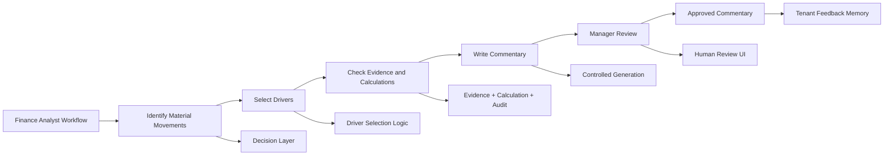
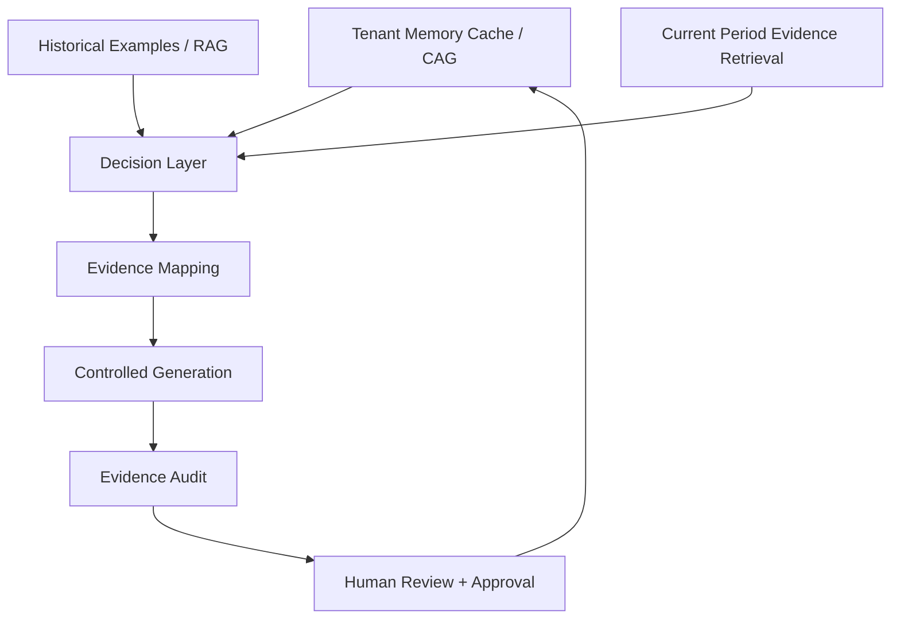
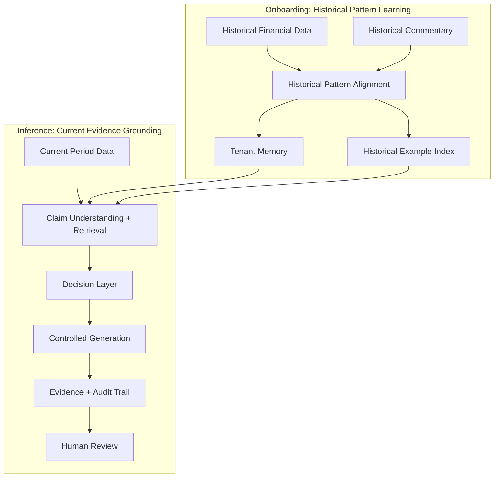
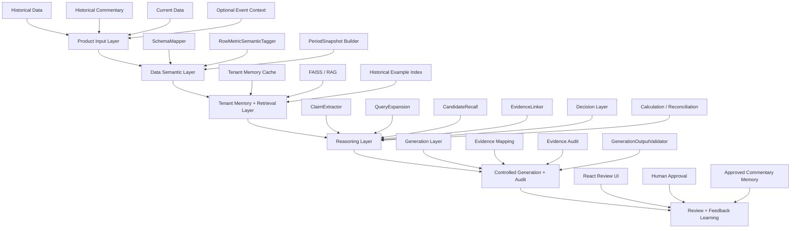
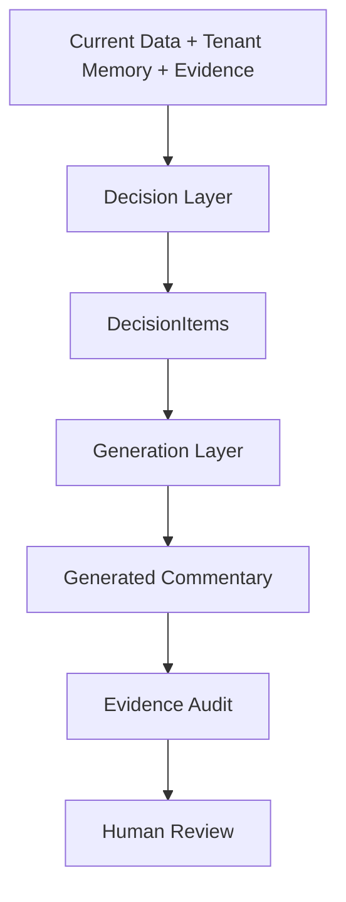
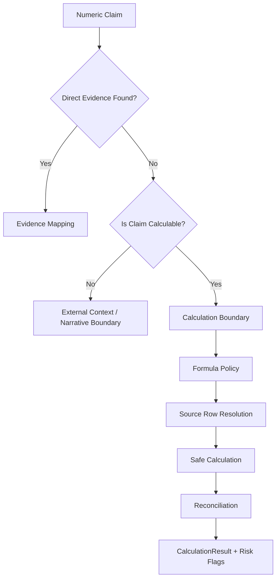

# FCA — Financial Commentary Autogeneration System

### An Explainable AI Financial Analyst for FP&A Commentary

**FCA** is a tenant-aware, evidence-grounded AI system designed to help finance and FP&A teams generate period commentary from financial data, historical commentary patterns, and reviewable evidence trails.

This project is not a generic RAG chatbot or a simple LLM text-generation demo. It is a product-minded AI system that simulates how a finance analyst reasons through financial commentary: identifying material movements, selecting drivers, grounding claims in evidence, handling calculation boundaries, and producing commentary that can be reviewed, audited, and improved through feedback.

> **Core idea:** The goal is not to make AI sound like a financial analyst. The goal is to make AI behave like a reviewable financial analyst.

---

## 1. Product Overview

Finance teams repeatedly write monthly or quarterly commentary explaining financial performance, budget variance, prior-period movement, and business drivers.

This work is repetitive, but it is also high-stakes. A good commentary is not just fluent prose. It must be:

* consistent with the team’s historical writing pattern;
* grounded in the correct financial data;
* aligned with materiality and driver-selection logic;
* explainable to reviewers and managers;
* careful about calculation assumptions and unsupported claims;
* auditable enough for finance workflows.

FCA addresses this by combining tenant memory, dynamic retrieval, structured claim understanding, evidence grounding, calculation/reconciliation design, controlled generation, and human review.

---

## 2. Why This Problem Matters

Many AI writing tools can generate a paragraph that looks like financial commentary. But in real finance workflows, the difficult question is not only:

> Can the AI write a fluent paragraph?

The real question is:

> Can the AI decide what should be said, ground each important claim in evidence, flag unsupported statements, and support a human review process?

FCA is designed around this second question.

### Key pain points in current finance commentary workflows

| Pain Point                           | Why It Matters                                                         | FCA Design Response                                      |
| ------------------------------------ | ---------------------------------------------------------------------- | -------------------------------------------------------- |
| Repetitive commentary drafting       | Analysts repeatedly explain similar metrics and movements every period | Learn historical patterns and generate structured drafts |
| Inconsistent wording across analysts | Reviewers want standardized language and logic                         | Tenant-specific style and pattern memory                 |
| Driver selection is judgment-heavy   | Not every large movement should be discussed                           | Decision Layer separates what to say from how to say it  |
| Claims may lack evidence             | Finance commentary must be reviewable                                  | Claim-level evidence grounding and audit trail           |
| Some values require calculation      | Not all commentary claims map to one table row                         | Calculation and reconciliation boundary design           |
| External context may be needed       | Some explanations require event or management context                  | Event/context boundary and human review flags            |

---

## 3. Product Vision

FCA is designed to act as an **AI financial analyst coworker**, not as a generic chatbot.

The system should eventually allow finance teams to upload:

* historical financial data;
* historical commentary;
* current-period financial data;
* optional business or event context;
* finalized user edits and approval feedback.

The system then generates FP&A-style commentary with:

* selected evidence rows;
* claim-to-evidence mapping;
* driver-selection rationale;
* calculation lineage if derived metrics are used;
* confidence and risk flags;
* audit status;
* human-review-friendly outputs;
* feedback learning for future periods.

---

## 4. From FP&A Workflow to AI System

FCA starts from a real analyst workflow and converts it into a structured AI system.



The central design principle is:

> **Generation Layer = how to say it.**
> **Decision Layer = what to say and why.**

---

## 5. Why FCA Is Not Generic RAG

A simple RAG system retrieves historical examples and asks an LLM to write a new paragraph. FCA goes further.

FCA separates:

* stable tenant memory from dynamic evidence retrieval;
* historical pattern learning from current-period evidence grounding;
* claim understanding from candidate retrieval;
* evidence selection from final evidence audit;
* calculation reasoning from prose generation;
* product orchestration from UI display.



### CAG-enhanced RAG positioning

FCA is best described as:

> **Tenant Memory Cache + Dynamic Evidence Retrieval + Auditable Claim-Grounded Generation**

* **CAG / Tenant Memory Cache** stores stable tenant knowledge: style, glossary, commentary patterns, materiality preferences, calculation/audit policies, and known caveats.
* **RAG / Retrieval** retrieves dynamic historical examples and current-period evidence candidates.
* **Evidence Mapping and Audit** ensure that generated commentary is grounded and reviewable.
* **Decision Layer** determines what should be discussed before generation.

---

## 6. Onboarding vs Inference

FCA separates historical learning from current-period grounding.

### Onboarding Phase

Input:

* historical financial data;
* historical commentary.

Goal:

* learn how the tenant historically writes commentary;
* learn which metrics and drivers are usually discussed;
* learn materiality patterns, grouping patterns, ordering habits, and phrasing style;
* build tenant memory and historical example index.

Onboarding is **not** meant to be perfect final audit for every historical sentence. It is historical pattern learning.

### Inference Phase

Input:

* current-period data;
* tenant memory;
* retrieved historical examples;
* optional confirmed current-period event context.

Goal:

* understand current-period data;
* decide what should be written;
* retrieve and select current-period evidence;
* calculate or flag derived metrics when needed;
* generate commentary;
* produce evidence and audit artifacts for human review.



---

## 7. System Architecture

FCA uses a layered architecture to preserve responsibility boundaries.



---

## 8. AI Boundary Design

A central theme of FCA is **knowing where AI helps and where AI must be constrained**.

LLMs are useful for:

* semantic understanding;
* claim extraction;
* retrieval query expansion;
* candidate evidence judgment;
* structured generation;
* reasoning assistance.

But FCA does **not** allow the LLM to freely:

* invent financial numbers;
* treat unsupported claims as supported;
* execute unvalidated formulas;
* bypass calculation policy;
* introduce unconfirmed event explanations;
* decide all commentary logic inside a single generation prompt.

### Boundary examples

| Boundary         | AI Can Help With                           | AI Must Not Do Freely                    | FCA Control Mechanism                       |
| ---------------- | ------------------------------------------ | ---------------------------------------- | ------------------------------------------- |
| Evidence         | Understand claims and judge candidates     | Fabricate support                        | EvidenceLinker + EvidenceAudit              |
| Calculation      | Identify possible calculation need         | Invent formulas or values                | Formula policy + deterministic evaluator    |
| Business context | Detect when external context may be needed | Make up macro or management explanations | Event context boundary + human review       |
| Generation       | Write in tenant style                      | Decide unsupported claims                | DecisionItems + EvidenceRecords + validator |
| Feedback         | Learn from approved edits                  | Override audit rules                     | Approved commentary memory with governance  |

---

## 9. Claim-Grounded Evidence Pipeline

Financial commentary bullets often contain multiple claims. A single bullet may include a current value, a variance, a ratio, a driver, and a contextual explanation.

FCA therefore decomposes commentary into claims before evidence selection.


Example:

```text
Bullet: "Net charge-offs were $1.1B, down $412MM year-over-year, driven by Card."

Extracted claims:
1. Current value claim: Net charge-offs = $1.1B
2. Variance claim: down $412MM year-over-year
3. Driver claim: driven by Card

Evidence mapping:
- Claim 1 → Net charge-offs current-period row
- Claim 2 → Same row via derived year-over-year delta
- Claim 3 → Card-related driver evidence row or flagged if unsupported
```

This prevents the system from treating a multi-claim financial statement as one fuzzy text-matching problem.

---

## 10. Decision Layer vs Generation Layer

FCA deliberately separates reasoning from writing.

### Decision Layer

Responsible for:

* deciding what should be discussed;
* selecting material drivers;
* deciding what should be omitted;
* referencing historical tenant patterns;
* checking support level and risk flags;
* deciding whether calculation or external context is needed;
* producing structured `DecisionItems`.

### Generation Layer

Responsible for:

* writing commentary in tenant style;
* following structured DecisionItems;
* using linked EvidenceRecords and CalculationResults;
* avoiding unsupported claims;
* returning structured output for validation.



---

## 11. Calculation and Reconciliation Design

Some commentary claims cannot be supported by a single table row.

Examples:

* variance amounts;
* ratio metrics;
* component contribution;
* multi-row aggregation;
* tenant-specific formula conventions;
* period basis differences;
* annualized vs quarterly calculations.

FCA is designed to avoid misclassifying these cases as unsupported narrative claims.



### MVP1 approach

MVP1 does not overbuild full formula repair. Instead, it:

* supports lightweight deterministic calculation;
* preserves lineage and risk flags;
* flags multi-row or formula-repair cases as calculation capability boundaries;
* avoids pretending that every uncovered claim is a true evidence failure.

### Final architecture direction

A future `CalculationAgent` should support:

* controlled formula repair;
* related-row search;
* reconciliation against known totals;
* alternative formula checks;
* confidence scoring;
* human-review-friendly calculation lineage.

---

## 12. Evidence Mapping and Audit Trail

FCA’s output should not be only a paragraph. It should be a reviewable artifact.

A generated commentary bullet should be linked to:

* claims;
* selected evidence rows;
* support status;
* match basis;
* calculation results if applicable;
* risk flags;
* audit status.

Example sanitized audit trace:

| Claim                      | Evidence            | Match Basis             | Support Status   | Risk Flag              |
| -------------------------- | ------------------- | ----------------------- | ---------------- | ---------------------- |
| Net charge-offs were $1.1B | Net charge-offs row | current_period_value    | Covered          | None                   |
| Down $412MM YoY            | Net charge-offs row | derived_delta_match     | Covered          | None                   |
| Driven by Card             | Card Services row   | driver_component_match  | Covered / Review | Scope check            |
| Due to macro outlook       | N/A                 | external_context_needed | Not covered      | Event context required |

---

## 13. Demo Walkthrough

A future demo flow should show the user experience end to end.


### Demo artifacts to include

* sanitized financial input preview;
* generated commentary card;
* evidence and audit table;
* confidence / risk flag panel;
* human review / approval mockup.

---

## 14. Evaluation and Claim Coverage Audit

FCA should not be evaluated only by whether the generated text sounds fluent.

The system should evaluate whether commentary claims are:

* directly covered by evidence;
* covered through derived delta or calculation;
* calculation-boundary cases;
* external-context-needed cases;
* unsupported due to retrieval or mapping failure;
* ambiguous and requiring manual review.

Example evaluation summary:

| Category                | Meaning                                  | Example Action                         |
| ----------------------- | ---------------------------------------- | -------------------------------------- |
| Covered                 | Claim has valid evidence                 | Accept or review                       |
| Calculation Boundary    | Claim likely needs formula / aggregation | Defer to CalculationAgent              |
| External Context Needed | Claim requires business/event context    | Request user confirmation              |
| Retrieval Gap           | Correct evidence not retrieved           | Improve retrieval/query expansion      |
| Mapping Gap             | Evidence exists but was not attached     | Fix EvidenceLinker / SupportAssessment |
| Manual Review           | Ambiguous or low-confidence              | Human reviewer decision                |

This evaluation style reflects a boundary-aware AI system: the goal is not to force every claim to be covered, but to classify why each claim is or is not supportable.

---

## 15. Technical Stack

Planned / implemented stack areas include:

| Layer               | Technologies / Concepts                                                             |
| ------------------- | ----------------------------------------------------------------------------------- |
| Backend             | Python, FastAPI, Pydantic                                                           |
| Retrieval           | FAISS, embeddings, tenant-isolated vector stores                                    |
| LLM Orchestration   | role-based LLM routing, structured outputs                                          |
| Data Processing     | financial table normalization, schema mapping, period snapshots                     |
| Reasoning Modules   | ClaimExtractor, QueryExpansion, EvidenceLinker, Decision Layer, Calculation support |
| Generation          | controlled generation prompt, structured output validation                          |
| Frontend            | React demo UI                                                                       |
| Evaluation          | claim coverage audit, smoke tests, artifact-based review                            |
| Future Architecture | multi-agent workflow, LangGraph or equivalent orchestration                         |

---

## 16. MVP vs Production vs Final Architecture

### MVP1

Focus:

* correct responsibility boundaries;
* tenant-isolated RAG;
* lightweight calculation support;
* claim-aware evidence linking;
* controlled generation;
* reviewable debug artifacts;
* React/FastAPI demo readiness;
* manual real-provider smoke and output quality evaluation.

MVP1 intentionally does **not** attempt to solve every final capability.

### Later Production Version

Focus:

* stronger observability;
* async/background processing;
* richer approval workflow;
* persistent approved commentary memory;
* recency-aware retrieval weighting;
* recall fallback;
* stronger calculation and evidence audit;
* more robust UI review experience.

### Final Multi-Agent Architecture

Potential agents:

* ProductInputPreparationAgent;
* DataSemanticsAgent;
* TenantMemoryBuilder / PatternMemoryAgent;
* ClaimUnderstandingAgent;
* SemanticQueryExpansionAgent;
* RetrievalAgent;
* EvidenceCandidateAgent;
* Decision / DriverSelectionAgent;
* CalculationAgent;
* EvidenceMappingAgent;
* EvidenceAuditAgent;
* GenerationAgent;
* EventContextAgent;
* FeedbackLearningAgent.

---

## 17. Key Design Principles

### 1. Do not make the Generation Layer a black box

Generation should write from structured, evidence-backed inputs. It should not independently decide all evidence, calculations, driver selection, and event explanations.

### 2. MVP can simplify capability, but should not misplace responsibility boundaries

A simplified MVP is acceptable. A misplaced responsibility boundary is not.

### 3. Historical learning is not the same as current evidence audit

Onboarding learns tenant patterns. Inference grounds current claims.

### 4. A failed calculation does not automatically mean no evidence exists

Some claims require formula repair, related-row search, aggregation, or reconciliation.

### 5. Not every claim should be forced into numeric evidence

Qualitative or event-driven explanations may require external context and human confirmation.

### 6. Human review is part of the product, not an afterthought

FCA is designed to produce reviewable artifacts, not just final text.

---

## 18. Roadmap

Near-term:

* improve demo-facing portfolio materials;
* add polished architecture diagrams;
* add sanitized UI screenshots;
* summarize claim coverage audit results;
* prepare a concise product walkthrough.

Mid-term:

* strengthen evidence recall fallback;
* improve calculation boundary classification;
* add approval feedback memory;
* improve React review workflow;
* optimize latency and payload size.

Long-term:

* evolve into a multi-agent financial analyst system;
* support controlled formula repair and reconciliation;
* support event context confirmation;
* support recency-aware tenant pattern drift;
* support full claim-level evidence audit and feedback learning.

---

## 19. Repository Disclosure Note

The full implementation codebase, detailed prompts, proprietary contracts, raw datasets, and internal debug artifacts are kept private.

This public case study is intended to share the product vision, architecture, reasoning workflow, sanitized examples, and evaluation approach without exposing sensitive implementation details or confidential data.

---

## 20. One-Sentence Summary

FCA is an evidence-grounded, tenant-aware AI financial analyst system that turns repetitive FP&A commentary work into a structured, reviewable, auditable, and continuously improving AI workflow.
