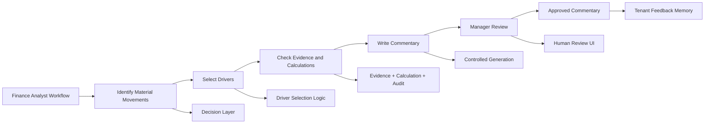
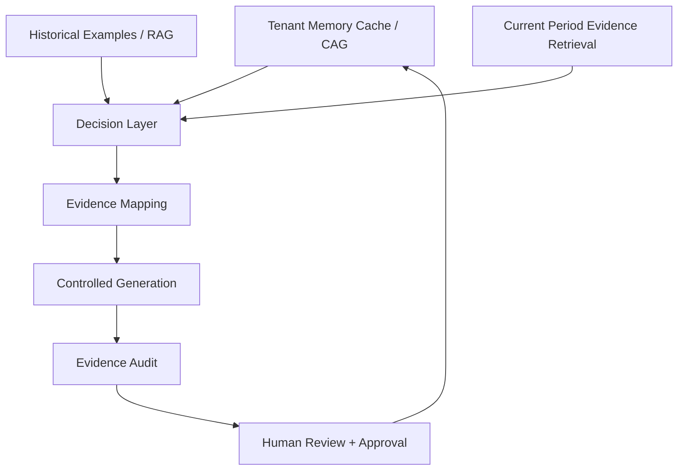
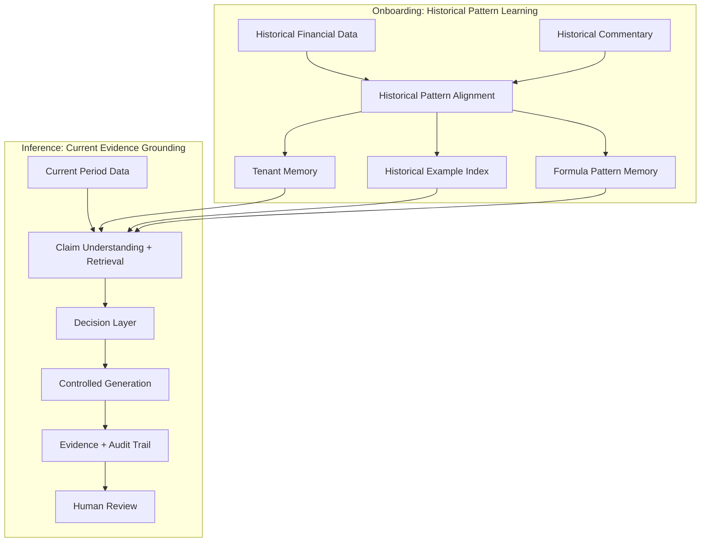
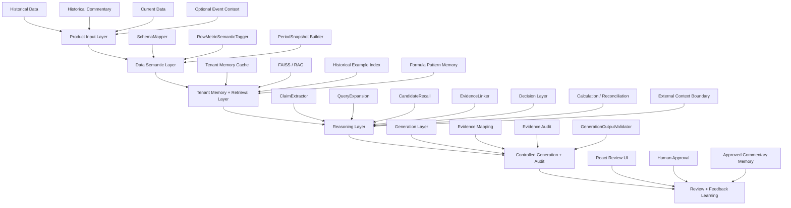
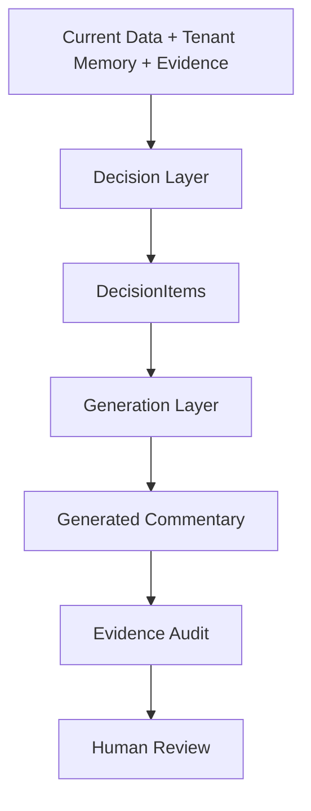
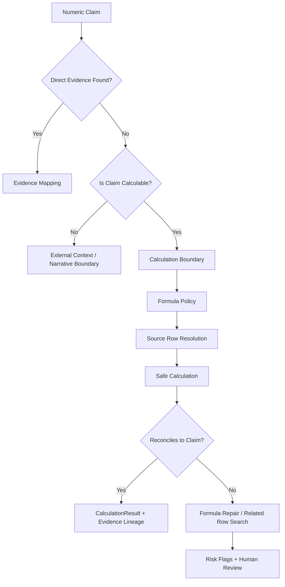
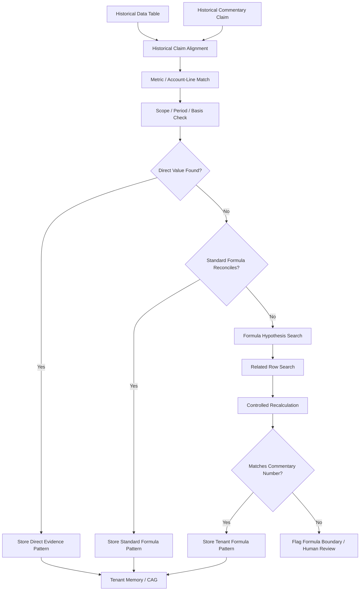
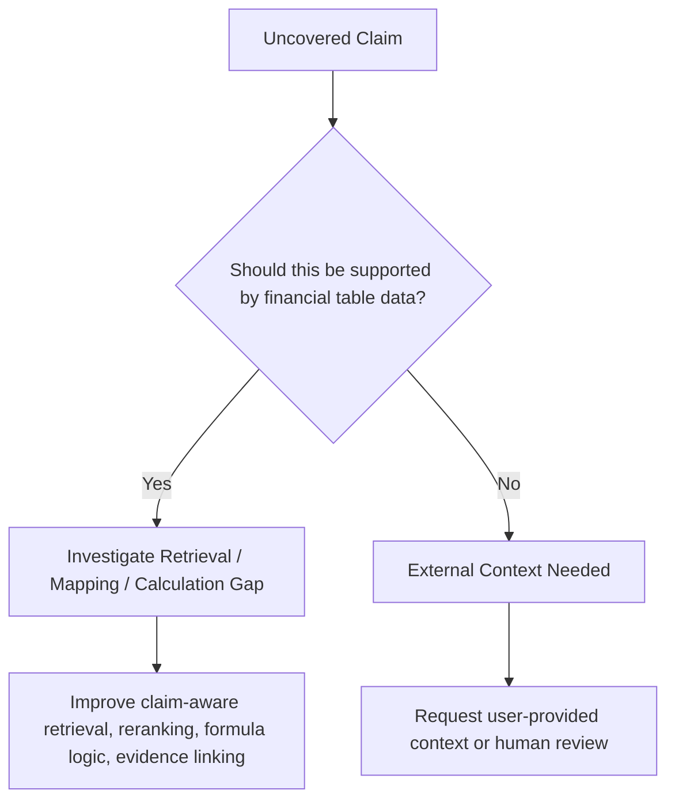
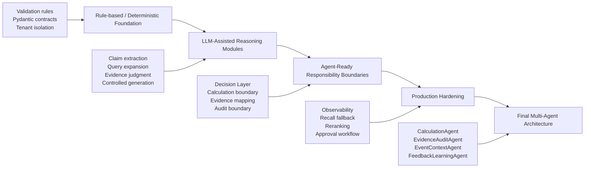

# FCA — Financial Commentary Autogeneration System

### An Explainable AI Financial Analyst for FP&A Commentary

**FCA** is a tenant-aware, evidence-grounded AI system designed to help finance and FP&A teams generate period commentary from financial data, historical commentary patterns, and reviewable evidence trails.

This project is not a generic RAG chatbot or a simple LLM text-generation demo. It is a product-minded AI system that simulates how a finance analyst reasons through financial commentary: identifying material movements, selecting drivers, grounding claims in evidence, handling calculation boundaries, learning tenant-specific formulas, and producing commentary that can be reviewed, audited, and improved through feedback.

> **Core idea:** The goal is not to make AI sound like a financial analyst. The goal is to make AI behave like a reviewable financial analyst.

---

## 1. Product Overview

Finance teams repeatedly write monthly or quarterly commentary explaining financial performance, budget variance, prior-period movement, and business drivers.

This work is repetitive, but it is also high-stakes. A good commentary is not just fluent prose. It must be:

- consistent with the team’s historical writing pattern;
- grounded in the correct financial data;
- aligned with materiality and driver-selection logic;
- explainable to reviewers and managers;
- careful about calculation assumptions and unsupported claims;
- auditable enough for finance workflows.

FCA addresses this by combining tenant memory, dynamic retrieval, structured claim understanding, evidence grounding, calculation/reconciliation design, controlled generation, and human review.

---

## 2. Why This Problem Matters

Many AI writing tools can generate a paragraph that looks like financial commentary. But in real finance workflows, the difficult question is not only:

> Can the AI write a fluent paragraph?

The real question is:

> Can the AI decide what should be said, ground each important claim in evidence, flag unsupported statements, distinguish data-supported claims from external-context claims, and support a human review process?

FCA is designed around this second question.

### Key pain points in current finance commentary workflows

| Pain Point | Why It Matters | FCA Design Response |
|---|---|---|
| Repetitive commentary drafting | Analysts repeatedly explain similar metrics and movements every period | Learn historical patterns and generate structured drafts |
| Inconsistent wording across analysts | Reviewers want standardized language and logic | Tenant-specific style and pattern memory |
| Driver selection is judgment-heavy | Not every large movement should be discussed | Decision Layer separates what to say from how to say it |
| Claims may lack evidence | Finance commentary must be reviewable | Claim-level evidence grounding and audit trail |
| Some values require calculation | Not all commentary claims map to one table row | Calculation and reconciliation boundary design |
| Company-specific formulas may differ | Standard formulas may not match how a team reports metrics | Tenant formula learning and formula memory |
| External context may be needed | Some explanations require events, management narrative, or macro context | Event/context boundary and human review flags |

---

## 3. Product Vision

FCA is designed to act as an **AI financial analyst coworker**, not as a generic chatbot.

The system should eventually allow finance teams to upload:

- historical financial data;
- historical commentary;
- current-period financial data;
- optional business or event context;
- finalized user edits and approval feedback.

The system then generates FP&A-style commentary with:

- selected evidence rows;
- claim-to-evidence mapping;
- driver-selection rationale;
- calculation lineage if derived metrics are used;
- confidence and risk flags;
- audit status;
- human-review-friendly outputs;
- feedback learning for future periods.

---

## 4. From FP&A Workflow to AI System

FCA starts from a real analyst workflow and converts it into a structured AI system.



The central design principle is:

> **Generation Layer = how to say it.**  
> **Decision Layer = what to say and why.**

---

## 5. Why FCA Is Not Generic RAG

A simple RAG system retrieves historical examples and asks an LLM to write a new paragraph. FCA goes further.

FCA separates:

- stable tenant memory from dynamic evidence retrieval;
- historical pattern learning from current-period evidence grounding;
- claim understanding from candidate retrieval;
- evidence selection from final evidence audit;
- calculation reasoning from prose generation;
- product orchestration from UI display.



### CAG-enhanced RAG positioning

FCA is best described as:

> **Tenant Memory Cache + Dynamic Evidence Retrieval + Auditable Claim-Grounded Generation**

- **CAG / Tenant Memory Cache** stores stable tenant knowledge: style, glossary, commentary patterns, materiality preferences, calculation/audit policies, learned formulas, and known caveats.
- **RAG / Retrieval** retrieves dynamic historical examples and current-period evidence candidates.
- **Evidence Mapping and Audit** ensure that generated commentary is grounded and reviewable.
- **Decision Layer** determines what should be discussed before generation.

---

## 6. Onboarding vs Inference

FCA separates historical learning from current-period grounding.

### Onboarding Phase

Input:

- historical financial data;
- historical commentary.

Goal:

- learn how the tenant historically writes commentary;
- learn which metrics and drivers are usually discussed;
- learn materiality patterns, grouping patterns, ordering habits, and phrasing style;
- identify formulas or calculation conventions that explain historical commentary numbers;
- build tenant memory and historical example index.

Onboarding is **not** meant to be perfect final audit for every historical sentence. It is historical pattern learning and weak historical alignment.

### Inference Phase

Input:

- current-period data;
- tenant memory;
- retrieved historical examples;
- optional confirmed current-period event context.

Goal:

- understand current-period data;
- decide what should be written;
- retrieve and select current-period evidence;
- calculate or flag derived metrics when needed;
- apply learned tenant formula patterns when appropriate;
- generate commentary;
- produce evidence and audit artifacts for human review.



---

## 7. System Architecture

FCA uses a layered architecture to preserve responsibility boundaries.



---

## 8. AI Boundary Design

A central theme of FCA is **knowing where AI helps and where AI must be constrained**.

LLMs are useful for:

- semantic understanding;
- claim extraction;
- retrieval query expansion;
- candidate evidence judgment;
- formula hypothesis generation;
- structured generation;
- reasoning assistance.

But FCA does **not** allow the LLM to freely:

- invent financial numbers;
- treat unsupported claims as supported;
- execute unvalidated formulas;
- bypass calculation policy;
- introduce unconfirmed event explanations;
- decide all commentary logic inside a single generation prompt.

### Boundary examples

| Boundary | AI Can Help With | AI Must Not Do Freely | FCA Control Mechanism |
|---|---|---|---|
| Evidence | Understand claims and judge candidates | Fabricate support | EvidenceLinker + EvidenceAudit |
| Calculation | Identify possible calculation need or propose candidate formulas | Invent formulas or values without validation | Formula policy + deterministic evaluator + reconciliation |
| Business context | Detect when external context may be needed | Make up macro or management explanations | Event context boundary + human review |
| Generation | Write in tenant style | Decide unsupported claims | DecisionItems + EvidenceRecords + validator |
| Feedback | Learn from approved edits | Override audit rules | Approved commentary memory with governance |

---

## 9. Claim-Grounded Evidence Pipeline

Financial commentary bullets often contain multiple claims. A single bullet may include a current value, a variance, a ratio, a driver, and a contextual explanation.

FCA therefore decomposes commentary into claims before evidence selection.


Example:

```text
Bullet: "Net charge-offs were $1.1B, down $412MM year-over-year, driven by Card."

Extracted claims:
1. Current value claim: Net charge-offs = $1.1B
2. Variance claim: down $412MM year-over-year
3. Driver claim: driven by Card

Evidence mapping:
- Claim 1 → Net charge-offs current-period row
- Claim 2 → Same row via derived year-over-year delta
- Claim 3 → Card-related driver evidence row or flagged if unsupported
```

This prevents the system from treating a multi-claim financial statement as one fuzzy text-matching problem.

---

## 10. Design Challenge: Evidence Recall and Re-ranking

One of the key system challenges in FCA is that evidence grounding can fail before the EvidenceLinker even runs.

In an early pipeline design, the system expanded retrieval queries before decomposing commentary into structured claims. The retrieval stage then selected a top-50 candidate pool for downstream evidence linking.

This created a practical failure mode: the correct evidence row was sometimes not included in the top-50 candidates. Once that happened, the EvidenceLinker had no opportunity to select the right support, even if its reasoning was correct.

FCA addressed this by moving claim extraction earlier in the pipeline:

```text
Before:
QueryExpansion → CandidateRecall(top-50) → Claim Extraction / Evidence Linking

After:
ClaimExtractor → Claim-aware QueryExpansion → CandidateRecall(top-50) → EvidenceLinker
```

This made retrieval more targeted because each query was grounded in a structured claim rather than a broad commentary paragraph.

However, top-50 recall can still miss relevant rows when financial terminology is ambiguous, scope differs across rows, or a claim requires derived calculation. For production hardening, FCA is designed to support a wider candidate recall stage followed by second-pass re-ranking:

```text
Claim-aware QueryExpansion
→ CandidateRecall(top-200)
→ Re-ranking / second-pass selection
→ EvidenceLinker
→ EvidenceAudit
```

This follows a common retrieval-system pattern: use a broader recall stage to avoid missing relevant evidence, then apply a more expensive ranking or reasoning step to select the best support.

The lesson is that evidence grounding is not only a generation problem. It is a **recall, ranking, support-validation, and audit problem**.

---

## 11. Decision Layer vs Generation Layer

FCA deliberately separates reasoning from writing.

### Decision Layer

Responsible for:

- deciding what should be discussed;
- selecting material drivers;
- deciding what should be omitted;
- referencing historical tenant patterns;
- checking support level and risk flags;
- deciding whether calculation or external context is needed;
- producing structured `DecisionItems`.

### Generation Layer

Responsible for:

- writing commentary in tenant style;
- following structured DecisionItems;
- using linked EvidenceRecords and CalculationResults;
- avoiding unsupported claims;
- returning structured output for validation.



---

## 12. Calculation and Reconciliation Design

Some commentary claims cannot be supported by a single table row.

Examples:

- variance amounts;
- ratio metrics;
- component contribution;
- multi-row aggregation;
- tenant-specific formula conventions;
- period basis differences;
- annualized vs quarterly calculations.

FCA is designed to avoid misclassifying these cases as unsupported narrative claims.



### MVP approach

FCA starts with a controlled foundation:

- pre-compute common deterministic variants such as standard period-over-period deltas;
- preserve calculation lineage and risk flags;
- classify multi-row or formula-repair cases as calculation capability boundaries;
- avoid pretending that every uncovered numeric claim is a true evidence failure.

This is not a limitation of the product vision. It is a deliberate staged approach: first make standard calculations reliable and auditable, then expand into controlled formula repair once boundaries and validation logic are clear.

### Final architecture direction

A future `CalculationAgent` should support:

- controlled formula repair;
- related-row search;
- reconciliation against known totals;
- alternative formula checks;
- confidence scoring;
- human-review-friendly calculation lineage.

---

## 13. Design Challenge: Tenant-Specific Formula Learning

A major challenge in financial commentary is that some numbers are not simple table lookups or standard variances.

For example, a commentary claim may refer to a value that looks like a period-over-period change, but the actual reporting logic may depend on multiple related rows, such as a balance movement plus a related commitment component. In these cases, a simple `current period minus prior period` rule may not reconcile to the number mentioned in the commentary.

FCA treats this as a **formula-learning and reconciliation problem**, not a generation problem.

During onboarding, the system has access to both historical financial tables and historical commentary. That creates an opportunity to ask:

> What combination of available data rows, period references, scope, basis, and calculation logic can explain the number that analysts historically wrote?

The goal is to learn tenant-specific formula patterns and preserve them in tenant memory.

### Three-way support check

When FCA tries to determine whether a claim is supported, it should not rely on text similarity alone. A strong support match should satisfy three dimensions:

| Support Dimension | What It Checks | Example |
|---|---|---|
| Metric / account-line alignment | The evidence row refers to the right business metric or account line | The row represents allowance, charge-offs, revenue, expenses, etc. |
| Numeric reconciliation | The stated number can be directly found or deterministically calculated | Current value, variance, ratio, component sum, or learned formula result matches the claim |
| Scope / period / basis alignment | The evidence uses the same reporting scope, period reference, unit, and basis | Firmwide vs LOB, reported vs managed, current quarter vs YTD, millions vs percentages |

This turns onboarding into a practical pattern-learning loop: FCA can test candidate formulas against historical commentary and keep the formulas that reconcile across the right metric, number, and reporting context.



### Why this matters

This allows FCA to distinguish between:

| Case | Example | System Response |
|---|---|---|
| Direct evidence | The number appears in the table | Link evidence row |
| Standard derived evidence | Simple variance, ratio, or component calculation reconciles | Store calculation lineage |
| Tenant-specific formula | Standard formula fails, but related rows can explain the number | Store learned formula pattern after reconciliation |
| Formula boundary | No validated formula reconciles | Flag as calculation-boundary / human review |
| External event context | Explanation depends on event or management narrative | Do not force numeric evidence; request context |

### Future CalculationAgent behavior

In the final architecture, when a standard calculation fails, the system should not immediately label the claim unsupported. Instead, a controlled `CalculationAgent` should:

1. detect the mismatch between the claim amount and the simple formula result;
2. search related rows, metric variants, and reporting basis candidates;
3. consult tenant memory, formula policy, approved formula registry, and potentially trusted documentation sources;
4. propose candidate formulas under policy;
5. run deterministic recalculation;
6. reconcile the result against the commentary target and any known reported anchors;
7. store validated tenant-specific formulas in tenant memory;
8. flag unresolved cases as calculation-boundary rather than unsupported evidence.

This is one of the reasons FCA uses a staged architecture: formula repair requires iteration, tool use, reconciliation, and careful audit. It is a strong candidate for future agentization, but only after deterministic validation and responsibility boundaries are clear.

### Product framing

This capability should not be framed as a separate future expansion called “validation.” It is part of FCA’s core trust layer.

FCA naturally checks whether commentary claims, source evidence, and underlying calculations reconcile before analyst review. In other words:

> FCA does not only generate commentary. It checks whether the numbers behind the commentary make sense.

---

## 14. Special Events vs Table-Supported Claims

Not every commentary claim is supposed to be supported by a financial data table.

During evaluation, FCA separates uncovered claims into at least two different categories:

1. **Table-supported but missed**  
   The supporting row or derivation exists in the uploaded data, but retrieval, calculation, or evidence linking failed to select it.

2. **External-context-dependent**  
   The claim depends on special events, macro context, management explanation, business narrative, or information not present in the data table.

This distinction is critical. FCA should improve retrieval and calculation for the first category, but should not hallucinate support for the second category.



This evaluation approach prevents the system from treating all uncovered claims as the same type of failure.

---

## 15. Evidence Mapping and Audit Trail

FCA’s output should not be only a paragraph. It should be a reviewable artifact.

A generated commentary bullet should be linked to:

- claims;
- selected evidence rows;
- support status;
- match basis;
- calculation results if applicable;
- risk flags;
- audit status.

Example sanitized audit trace:

A useful evidence record should make the support basis explicit, not just store a row ID. In FCA, support quality is judged across metric alignment, numeric reconciliation, and scope / period / basis consistency.

| Claim | Evidence | Match Basis | Support Status | Risk Flag |
|---|---|---|---|---|
| Net charge-offs were $1.1B | Net charge-offs row | current_period_value | Covered | None |
| Down $412MM YoY | Net charge-offs row | derived_delta_match | Covered | None |
| Driven by Card | Card Services row | driver_component_match | Covered / Review | Scope check |
| Due to macro outlook | N/A | external_context_needed | Not covered | Event context required |

---

## 16. Demo Walkthrough

A future demo flow should show the user experience end to end.


### Demo artifacts to include

- sanitized financial input preview;
- generated commentary card;
- evidence and audit table;
- confidence / risk flag panel;
- human review / approval mockup.

---

## 17. Evaluation and Claim Coverage Audit

FCA should not be evaluated only by whether the generated text sounds fluent.

The system should evaluate whether commentary claims are:

- directly covered by evidence;
- covered through derived delta or calculation;
- supported by learned tenant-specific formulas;
- calculation-boundary cases;
- external-context-needed cases;
- unsupported due to retrieval or mapping failure;
- ambiguous and requiring manual review.

Example evaluation summary:

| Category | Meaning | Example Action |
|---|---|---|
| Covered | Claim has valid direct evidence | Accept or review |
| Derived Coverage | Claim is supported through deterministic calculation | Show calculation lineage |
| Learned Formula Coverage | Claim is supported by a validated tenant-specific formula | Show formula pattern and reconciliation |
| Calculation Boundary | Claim likely needs formula repair or aggregation | Defer to CalculationAgent / human review |
| External Context Needed | Claim requires business/event context | Request user confirmation |
| Retrieval Gap | Correct evidence not retrieved | Improve retrieval/query expansion/reranking |
| Mapping Gap | Evidence exists but was not attached | Fix EvidenceLinker / SupportAssessment |
| Manual Review | Ambiguous or low-confidence | Human reviewer decision |

This evaluation style reflects a boundary-aware AI system: the goal is not to force every claim to be covered, but to classify why each claim is or is not supportable. It also creates a natural finance-grade trust layer: if FCA is already checking claims, evidence rows, and calculations, it can surface data inconsistencies, scope/basis risks, and formula gaps before those numbers become management commentary.

### Sample-driven debugging workflow

FCA improves through sample-driven investigation:

1. select representative commentary samples;
2. extract claims;
3. check whether each claim is covered;
4. verify whether covered claims are correctly supported;
5. classify uncovered claims as retrieval gap, mapping gap, calculation boundary, learned-formula candidate, external-context-needed, or manual-review-needed;
6. update retrieval, evidence linking, calculation, or product boundary logic accordingly.

This mirrors how production AI systems are improved: not by only optimizing one aggregate metric, but by repeatedly inspecting failure modes and turning them into clearer architecture boundaries.

---

## 18. Technical Stack

Planned / implemented stack areas include:

| Layer | Technologies / Concepts |
|---|---|
| Backend | Python, FastAPI, Pydantic |
| Retrieval | FAISS, embeddings, tenant-isolated vector stores, claim-aware retrieval, future reranking |
| LLM Orchestration | role-based LLM routing, structured outputs, controlled prompts |
| Data Processing | financial table normalization, schema mapping, period snapshots |
| Reasoning Modules | ClaimExtractor, QueryExpansion, CandidateRecall, EvidenceLinker, Decision Layer |
| Calculation | deterministic calculation variants, formula policy, future CalculationAgent |
| Generation | controlled generation prompt, structured output validation |
| Frontend | React demo UI |
| Evaluation | claim coverage audit, sample-driven debugging, smoke tests, artifact-based review |
| Memory | tenant memory cache, historical example index, formula pattern memory |
| Future Architecture | multi-agent workflow, LangGraph or equivalent orchestration |

---

## 19. Progressive Productization Strategy

FCA is intentionally designed as a staged productization path rather than an agent-heavy system from day one.

The initial implementation focuses on building a reliable, reviewable foundation first: clear module boundaries, deterministic guardrails, structured contracts, evidence artifacts, claim coverage diagnostics, and human-review-friendly outputs.

This is a deliberate engineering choice. In enterprise AI workflows, especially finance workflows, adding agents too early can hide responsibility boundaries and make errors harder to debug. FCA therefore starts with a controlled, modular MVP and evolves toward multi-agent orchestration only after the system has established which responsibilities should remain deterministic, which should be LLM-assisted, and which are mature enough to become agents.



This staged approach demonstrates a key product principle:

> Move fast enough to ship a useful AI workflow, but not so fast that the system becomes an unreviewable black box.

### Why not agent-heavy from day one?

| Design Question | FCA Approach |
|---|---|
| Should every reasoning step become an agent immediately? | No. First define clear responsibility boundaries and failure modes. |
| Should the LLM freely decide evidence, calculation, and generation together? | No. Separate claim understanding, retrieval, evidence linking, calculation, decision, generation, and audit. |
| Should MVP solve every final capability? | No. MVP should simplify capability while preserving correct architecture boundaries. |
| When should agents be introduced? | After the workflow proves which responsibilities require autonomous planning, tool use, fallback, or iterative repair. |
| What is the practical goal? | Build a system that is useful, debuggable, reviewable, and ready to evolve. |

---

## 20. MVP vs Production vs Final Architecture

### MVP

Focus:

- correct responsibility boundaries;
- tenant-isolated RAG;
- deterministic calculation variants;
- claim-aware evidence linking;
- controlled generation;
- claim coverage audit;
- reviewable debug artifacts;
- React/FastAPI demo readiness;
- manual real-provider smoke and output quality evaluation.

The MVP intentionally does **not** attempt to solve every final capability. Its purpose is to establish the right architecture boundaries and generate reviewable outputs.

### Later Production Version

Focus:

- stronger observability;
- async/background processing;
- richer approval workflow;
- persistent approved commentary memory;
- recency-aware retrieval weighting;
- recall fallback and reranking;
- stronger calculation and evidence audit;
- more robust UI review experience.

### Final Multi-Agent Architecture

Potential agents:

- ProductInputPreparationAgent;
- DataSemanticsAgent;
- TenantMemoryBuilder / PatternMemoryAgent;
- ClaimUnderstandingAgent;
- SemanticQueryExpansionAgent;
- RetrievalAgent;
- EvidenceCandidateAgent;
- Decision / DriverSelectionAgent;
- CalculationAgent;
- EvidenceMappingAgent;
- EvidenceAuditAgent;
- GenerationAgent;
- EventContextAgent;
- FeedbackLearningAgent.

---

## 21. Key Design Principles

### 1. Do not make the Generation Layer a black box

Generation should write from structured, evidence-backed inputs. It should not independently decide all evidence, calculations, driver selection, and event explanations.

### 2. MVP can simplify capability, but should not misplace responsibility boundaries

A simplified MVP is acceptable. A misplaced responsibility boundary is not.

### 3. Historical learning is not the same as current evidence audit

Onboarding learns tenant patterns. Inference grounds current claims.

### 4. A failed calculation does not automatically mean no evidence exists

Some claims require formula repair, related-row search, aggregation, or reconciliation.

### 5. Not every claim should be forced into numeric evidence

Qualitative or event-driven explanations may require external context and human confirmation.

### 6. Human review is part of the product, not an afterthought

FCA is designed to produce reviewable artifacts, not just final text.

### 7. Improve the system by investigating failure modes, not only by optimizing final text quality

The system should learn from cases where evidence is missed, calculation does not reconcile, or external context is required.

---

## 22. Recommended Portfolio Figures

For a public-facing product case study, the strongest figures are:

| Figure | Purpose |
|---|---|
| `fca_system_architecture_overview.png` | Show the end-to-end product architecture |
| `onboarding_vs_inference_comparison_chart.png` | Explain historical pattern learning vs current evidence grounding |
| `system_architecture_and_agent_evolution_diagram.png` | Show current implementation, guardrails, and future agent evolution |
| `evidence_recall_reranking_iteration.png` | Show how claim-aware retrieval and reranking improved evidence recall |
| `tenant_formula_learning_flow.png` | Show how onboarding can learn validated tenant-specific formulas |
| `claim_coverage_audit_matrix.png` | Show how covered, missed, calculable, and external-context claims are classified |

The first three figures are the most important for a short consultant review. The later figures are useful for a deeper technical case study.

---

## 23. Roadmap

Near-term:

- improve demo-facing portfolio materials;
- add polished architecture diagrams;
- add sanitized UI screenshots;
- summarize claim coverage audit results;
- prepare a concise product walkthrough.

Mid-term:

- strengthen evidence recall fallback and reranking;
- improve calculation boundary classification;
- add formula pattern memory;
- add approval feedback memory;
- improve React review workflow;
- optimize latency and payload size.

Long-term:

- evolve into a multi-agent financial analyst system;
- support controlled formula repair and reconciliation;
- support event context confirmation;
- support recency-aware tenant pattern drift;
- support full claim-level evidence audit and feedback learning.

---

## 24. Repository Disclosure Note

The full implementation codebase, detailed prompts, proprietary contracts, raw datasets, and internal debug artifacts are kept private.

This public case study is intended to share the product vision, architecture, reasoning workflow, sanitized examples, and evaluation approach without exposing sensitive implementation details or confidential data.

---

## 25. One-Sentence Summary

FCA is an evidence-grounded, tenant-aware AI financial analyst system that turns repetitive FP&A commentary work into a structured, reviewable, auditable, and continuously improving AI workflow.
