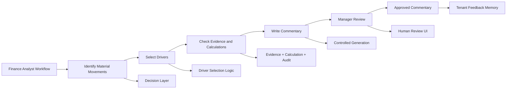
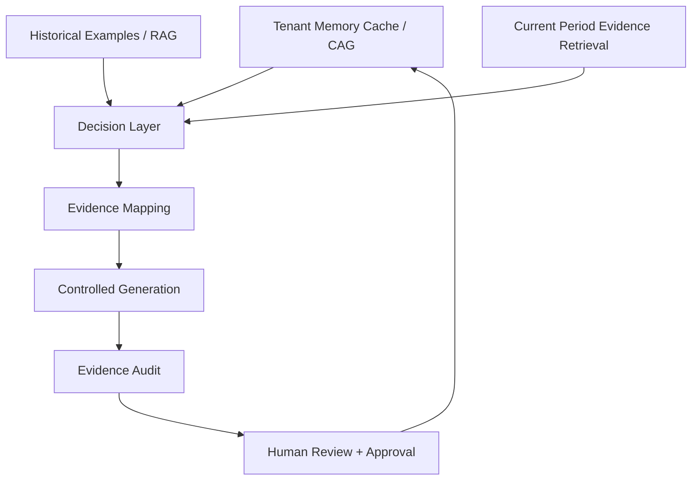
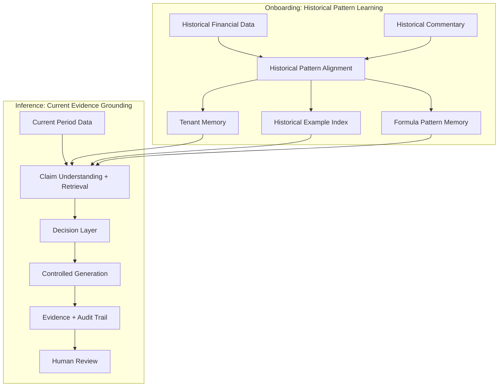
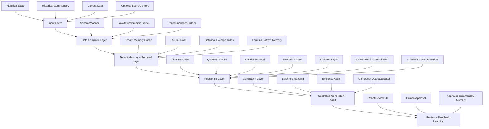
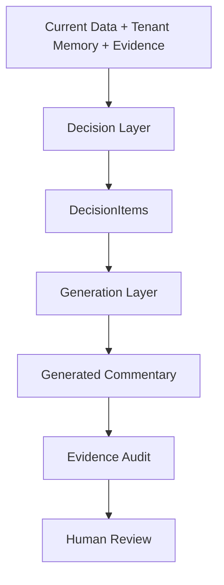
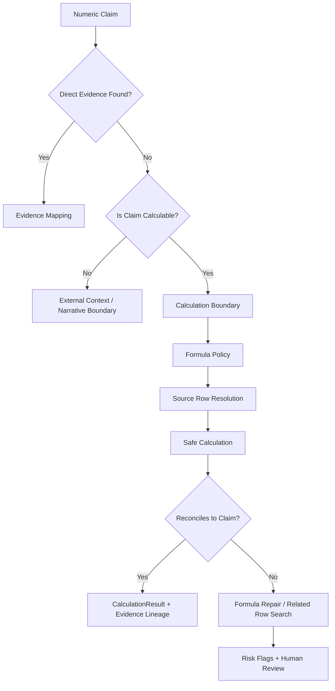
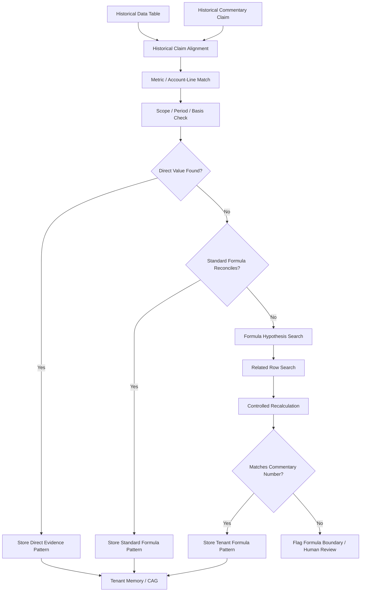
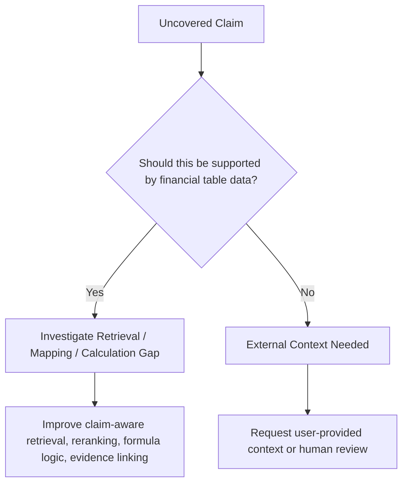
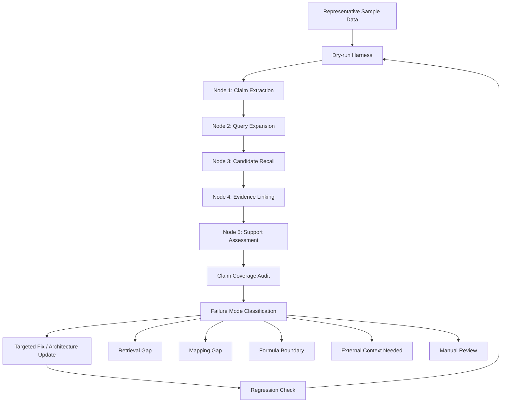
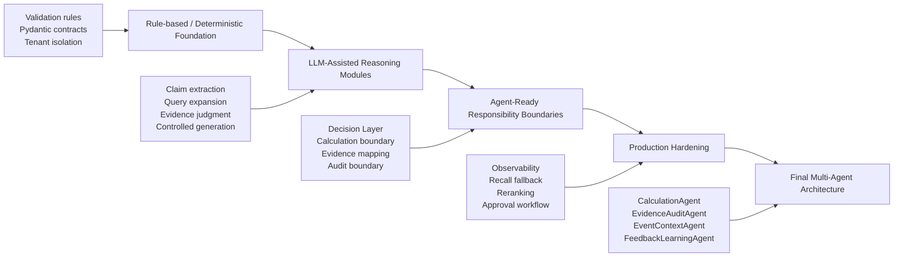

# FCA — 财务评论自动生成系统

### 一个面向证据驱动 FP&A 评论生成的 AI Engineering Case Study

**FCA** 是一个面向多租户、基于证据 grounding 的 AI 工程项目，探索如何基于财务数据、历史 commentary 写作模式，以及可复核的 evidence trail 来生成 FP&A commentary。

这个项目不是一个普通的 RAG chatbot，也不是一个简单的 LLM 文本生成 demo。它更像是一个关于 **boundary-aware AI system design（有边界意识的 AI 系统设计）** 的 portfolio case study：系统需要识别重要财务变动、选择 drivers、把 claims 绑定到 evidence、处理 calculation boundary、学习 tenant-specific formulas，并生成可以被 review、audit、以及通过 feedback 持续改进的 commentary。

> **核心理念：** 目标不是让 AI “听起来像”财务分析师，而是让 AI “表现得像”一个可复核的财务分析师。

> **Portfolio 范围说明：** 这份 README 是作为 AI engineering case study，用于 portfolio 展示和技术讨论。它聚焦于系统设计、实现 trade-off、debug workflow 和 evaluation strategy；不把 FCA 定位成商业产品，也不暴露私有实现细节。

---

## 1. 项目概览

Finance / FP&A 团队通常需要按月或按季度撰写 commentary，解释财务表现、budget variance、prior-period movement，以及业务 drivers。

这项工作虽然重复，但风险很高。一段好的 commentary 不只是文笔流畅。它还必须：

- 与团队历史写作风格保持一致；
- 基于正确的 financial data；
- 符合 materiality 和 driver-selection 逻辑；
- 能够被 reviewers 和 managers 解释和复核；
- 对 calculation assumptions 和 unsupported claims 保持谨慎；
- 足够 auditable，适合 finance workflow。

FCA 通过结合 tenant memory、dynamic retrieval、structured claim understanding、evidence grounding、calculation / reconciliation design、controlled generation 和 human review 来解决这个问题。

---

## 2. 为什么这个问题重要

很多 AI writing tools 都可以生成一段看起来像 financial commentary 的文字。但在真实 finance workflow 里，难点不只是：

> AI 能不能写出一段流畅的段落？

真正的问题是：

> 真正的难点不是 LLM 能不能写出一段流畅的 commentary，而是这个 AI 系统能不能判断什么值得写、把每个关键 claim 绑定到证据、标记 unsupported 或 calculation-boundary 的内容、区分表格数据可支持的 claim 和需要外部业务背景的 claim，并产出能支持人工 review 的审计材料。

FCA 是围绕第二个问题设计的。

### 当前 finance commentary workflow 的关键痛点

| 痛点 | 为什么重要 | FCA 的设计响应 |
|---|---|---|
| Commentary drafting 重复性高 | Analysts 每个 period 都要反复解释类似的 metrics 和 movements | 学习历史 patterns，生成 structured drafts |
| 不同 analysts 用词不一致 | Reviewers 希望语言和逻辑标准化 | Tenant-specific style 和 pattern memory |
| Driver selection 依赖判断 | 不是每个大变动都应该被讨论 | Decision Layer 区分 what to say 和 how to say it |
| Claims 可能缺少 evidence | Finance commentary 必须可复核 | Claim-level evidence grounding 和 audit trail |
| 有些数值需要 calculation | 不是所有 commentary claims 都能对应到单一 table row | Calculation 和 reconciliation boundary design |
| 公司/团队特定公式可能不同 | Standard formulas 不一定匹配团队实际 reporting 口径 | Tenant formula learning 和 formula memory |
| 有些解释需要外部上下文 | 有些 claims 依赖 events、management narrative 或 macro context | Event/context boundary 和 human review flags |

---

## 3. 系统目标

FCA 被设计成一个 **AI-assisted financial analyst workflow**，而不是一个普通 chatbot。

这个项目的目标是展示：如何把一个 finance commentary workflow 拆解成一组 evidence-grounded、reviewable、并且可以安全迭代的技术组件。

目标 workflow 主要围绕以下输入：

- historical financial data；
- historical commentary；
- current-period financial data；
- optional business or event context；
- finalized user edits 和 approval feedback。

系统随后生成 FP&A-style commentary，并包含：

- selected evidence rows；
- claim-to-evidence mapping；
- driver-selection rationale；
- 如果使用 derived metrics，则包含 calculation lineage；
- confidence 和 risk flags；
- audit status；
- human-review-friendly outputs；
- 面向未来 periods 的 feedback learning。

---

## 4. 从 FP&A Workflow 到 AI System

FCA 从真实 analyst workflow 出发，并将其转化为一个结构化 AI 系统。



核心设计原则是：

> **Generation Layer = how to say it（怎么说）。**  
> **Decision Layer = what to say and why（说什么，以及为什么说）。**

---

## 5. 为什么 FCA 不是普通 Generic RAG

一个简单 RAG 系统会 retrieve 历史 examples，然后让 LLM 写一个新段落。FCA 做得更多。

FCA 区分了：

- stable tenant memory 和 dynamic evidence retrieval；
- historical pattern learning 和 current-period evidence grounding；
- claim understanding 和 candidate retrieval；
- evidence selection 和 final evidence audit；
- calculation reasoning 和 prose generation；
- workflow orchestration 和 UI display。



### CAG-enhanced RAG 定位

FCA 更准确地说是：

> **Tenant Memory Cache + Dynamic Evidence Retrieval + Auditable Claim-Grounded Generation**

- **CAG / Tenant Memory Cache** 存储稳定的 tenant knowledge：style、glossary、commentary patterns、materiality preferences、calculation / audit policies、learned formulas 和 known caveats。
- **RAG / Retrieval** 负责 retrieve dynamic historical examples 和 current-period evidence candidates。
- **Evidence Mapping and Audit** 确保 generated commentary 是 grounded 且 reviewable 的。
- **Decision Layer** 在 generation 之前决定什么应该被讨论。

---

## 6. Onboarding vs Inference

FCA 区分 historical learning 和 current-period grounding。

### Onboarding Phase

输入：

- historical financial data；
- historical commentary。

目标：

- 学习 tenant 历史上如何写 commentary；
- 学习哪些 metrics 和 drivers 通常会被讨论；
- 学习 materiality patterns、grouping patterns、ordering habits 和 phrasing style；
- 识别能解释历史 commentary 数字的 formulas 或 calculation conventions；
- 建立 tenant memory 和 historical example index。

Onboarding **不是** 对每一句历史 commentary 做严格的 final audit。它是 historical pattern learning 和 weak historical alignment。

### Inference Phase

输入：

- current-period data；
- tenant memory；
- retrieved historical examples；
- optional confirmed current-period event context。

目标：

- 理解 current-period data；
- 决定什么应该写；
- retrieve 和 select current-period evidence；
- 在需要时 calculate 或 flag derived metrics；
- 在合适时应用 learned tenant formula patterns；
- 生成 commentary；
- 生成给 human review 使用的 evidence 和 audit artifacts。



---

## 7. 系统架构

FCA 使用 layered architecture 来保持清晰的 responsibility boundaries。



---

## 8. AI Boundary Design

FCA 的核心主题之一是：**知道 AI 在哪里有帮助，以及在哪里必须被约束。**

LLM 适合用于：

- semantic understanding；
- claim extraction；
- retrieval query expansion；
- candidate evidence judgment；
- formula hypothesis generation；
- structured generation；
- reasoning assistance。

但 FCA **不允许** LLM 自由地：

- 编造 financial numbers；
- 把 unsupported claims 当成 supported；
- 执行未经验证的 formulas；
- 绕过 calculation policy；
- 引入未经确认的 event explanations；
- 在单一 generation prompt 中决定所有 commentary logic。

### Boundary examples

| Boundary | AI 可以帮助什么 | AI 不能自由做什么 | FCA 控制机制 |
|---|---|---|---|
| Evidence | 理解 claims 并判断 candidates | 编造 support | EvidenceLinker + EvidenceAudit |
| Calculation | 识别 calculation need 或提出 candidate formulas | 在未验证情况下编 formulas 或 values | Formula policy + deterministic evaluator + reconciliation |
| Business context | 识别可能需要 external context 的情况 | 编造 macro 或 management explanation | Event context boundary + human review |
| Generation | 按 tenant style 写作 | 自行决定 unsupported claims | DecisionItems + EvidenceRecords + validator |
| Feedback | 从 approved edits 中学习 | 覆盖 audit rules | 带 governance 的 Approved commentary memory |

---

## 9. Claim-Grounded Evidence Pipeline

Financial commentary bullet 通常包含多个 claims。一个 bullet 可能同时包含 current value、variance、ratio、driver 和 contextual explanation。

因此，FCA 会先把 commentary 分解成 claims，再做 evidence selection。


示例：

```text
Bullet: "Net charge-offs were $1.1B, down $412MM year-over-year, driven by Card."

Extracted claims:
1. Current value claim: Net charge-offs = $1.1B
2. Variance claim: down $412MM year-over-year
3. Driver claim: driven by Card

Evidence mapping:
- Claim 1 → Net charge-offs current-period row
- Claim 2 → Same row via derived year-over-year delta
- Claim 3 → Card-related driver evidence row or flagged if unsupported
```

这避免了系统把一个 multi-claim financial statement 当成一个模糊的 text-matching 问题处理。

---

## 10. Evidence Recall and Re-ranking

FCA 的一个关键系统挑战是：evidence grounding 可能在 EvidenceLinker 运行之前就已经失败。

早期 pipeline 设计中，系统会在把 commentary 分解成 structured claims 之前先做 retrieval query expansion。Retrieval stage 随后选择 top-50 candidate pool，供下游 evidence linking 使用。

这带来一个实际 failure mode：正确的 evidence row 有时没有进入 top-50 candidates。一旦发生这种情况，即使 EvidenceLinker 的 reasoning 是正确的，它也没有机会选中正确 support。

FCA 通过把 claim extraction 前移来解决这个问题：

```text
Before:
QueryExpansion → CandidateRecall(top-50) → Claim Extraction / Evidence Linking

After:
ClaimExtractor → Claim-aware QueryExpansion → CandidateRecall(top-50) → EvidenceLinker
```

这样 retrieval 更 targeted，因为每个 query 都基于 structured claim，而不是基于宽泛的 commentary paragraph。

不过，当财务术语有歧义、row scope 不同，或者 claim 需要 derived calculation 时，top-50 recall 仍可能漏掉相关 rows。为了 production hardening，FCA 被设计为支持更宽的 candidate recall stage，并在之后进行 second-pass re-ranking：

```text
Claim-aware QueryExpansion
→ CandidateRecall(top-200)
→ Re-ranking / second-pass selection
→ EvidenceLinker
→ EvidenceAudit
```

这遵循了常见 retrieval system pattern：先用更宽的 recall stage 避免漏掉 relevant evidence，再用更贵、更精细的 ranking 或 reasoning step 选择最佳 support。

这个经验说明：evidence grounding 不只是 generation problem。它是一个 **recall、ranking、support-validation 和 audit problem**。

---

## 11. Decision Layer vs Generation Layer

FCA 明确区分 reasoning 和 writing。

### Decision Layer

负责：

- 决定什么应该被讨论；
- 选择 material drivers；
- 决定什么应该省略；
- 引用 historical tenant patterns；
- 检查 support level 和 risk flags；
- 决定是否需要 calculation 或 external context；
- 生成 structured `DecisionItems`。

### Generation Layer

负责：

- 按 tenant style 写 commentary；
- 遵循 structured DecisionItems；
- 使用 linked EvidenceRecords 和 CalculationResults；
- 避免 unsupported claims；
- 返回可验证的 structured output。



---

## 12. Calculation and Reconciliation Design

有些 commentary claims 无法由单一 table row 支持。

示例包括：

- variance amounts；
- ratio metrics；
- component contribution；
- multi-row aggregation；
- tenant-specific formula conventions；
- period basis differences；
- annualized vs quarterly calculations。

FCA 被设计为避免把这些情况误判为 unsupported narrative claims。



### MVP approach

FCA 从一个可控 foundation 开始：

- 预先计算常见 deterministic variants，例如 standard period-over-period deltas；
- 保留 calculation lineage 和 risk flags；
- 将 multi-row 或 formula-repair cases 分类为 calculation capability boundaries；
- 避免把每一个 uncovered numeric claim 都假装成真实 evidence failure。

这不是项目范围的缺陷，而是 deliberate staged approach：先让标准 calculation 可靠、可审计，再在 boundary 和 validation logic 清晰后扩展到 controlled formula repair。

### Final architecture direction

未来的 `CalculationAgent` 应该支持：

- controlled formula repair；
- related-row search；
- reconciliation against known totals；
- alternative formula checks；
- confidence scoring；
- human-review-friendly calculation lineage。

---

## 13. Tenant-Specific Formula Learning

Financial commentary 的一个重要挑战是：有些数字不是简单 table lookup，也不是 standard variance。

例如，一条 commentary claim 可能引用了一个看起来像 period-over-period change 的数值，但实际 reporting logic 可能依赖多个相关 rows，例如某个 balance movement 加上 related commitment component。在这种情况下，简单的 `current period minus prior period` rule 可能无法 reconcile 到 commentary 中提到的数字。

FCA 把这视为 **formula-learning and reconciliation problem**，而不是 generation problem。

在 onboarding 阶段，系统同时拥有 historical financial tables 和 historical commentary。这使系统可以提出一个问题：

> 哪些可用 data rows、period references、scope、basis 和 calculation logic 的组合，可以解释 analysts 历史上写下的数字？

目标是学习 tenant-specific formula patterns，并将其保存在 tenant memory 中。

### Three-way support check

当 FCA 判断一个 claim 是否被支持时，不应该只依赖 text similarity。一个强 support match 应该满足三个维度：

| Support Dimension | 检查内容 | 示例 |
|---|---|---|
| Metric / account-line alignment | Evidence row 是否指向正确 business metric 或 account line | row 表示 allowance、charge-offs、revenue、expenses 等 |
| Numeric reconciliation | claim 中的数字是否能被直接找到或 deterministically calculated | current value、variance、ratio、component sum 或 learned formula result 与 claim 匹配 |
| Scope / period / basis alignment | evidence 是否使用相同 reporting scope、period reference、unit 和 basis | Firmwide vs LOB、reported vs managed、current quarter vs YTD、millions vs percentages |

这把 onboarding 变成了一个实用的 pattern-learning loop：FCA 可以用 historical commentary 测试 candidate formulas，并保留那些在 metric、number 和 reporting context 上都能 reconcile 的 formulas。



### 为什么这重要

这让 FCA 能区分：

| Case | 示例 | System Response |
|---|---|---|
| Direct evidence | 数字直接出现在 table 里 | Link evidence row |
| Standard derived evidence | 简单 variance、ratio 或 component calculation 可以 reconcile | Store calculation lineage |
| Tenant-specific formula | Standard formula 失败，但 related rows 可以解释这个数字 | Reconciliation 后 store learned formula pattern |
| Formula boundary | 没有 validated formula 可以 reconcile | Flag as calculation-boundary / human review |
| External event context | Explanation 依赖 event 或 management narrative | 不强行匹配 numeric evidence；request context |

### Future CalculationAgent behavior

在最终架构中，当 standard calculation 失败时，系统不应该立刻把 claim 标为 unsupported。相反，一个 controlled `CalculationAgent` 应该：

1. 检测 claim amount 和 simple formula result 之间的 mismatch；
2. 搜索 related rows、metric variants 和 reporting basis candidates；
3. 查询 tenant memory、formula policy、approved formula registry，以及可能的 trusted documentation sources；
4. 在 policy 下提出 candidate formulas；
5. 执行 deterministic recalculation；
6. 将结果与 commentary target 和已知 reported anchors reconcile；
7. 将 validated tenant-specific formulas 存入 tenant memory；
8. 将 unresolved cases 标记为 calculation-boundary，而不是 unsupported evidence。

这也是 FCA 使用 staged architecture 的原因之一：formula repair 需要 iteration、tool use、reconciliation 和 careful audit。它很适合未来 agentization，但必须等 deterministic validation 和 responsibility boundaries 清楚以后。

### System framing

这个能力不应该被描述成一个单独附加功能叫 “validation”。它是 FCA core trust layer 的一部分。

FCA 会自然检查 commentary claims、source evidence 和 underlying calculations 是否能在 analyst review 前 reconcile。换句话说：

> FCA 不只是生成 commentary。它还会检查 commentary 背后的数字是否说得通。

---

## 14. Special Events vs Table-Supported Claims

不是每个 commentary claim 都应该由 financial data table 支持。

在 evaluation 过程中，FCA 至少把 uncovered claims 分成两类：

1. **Table-supported but missed**  
   支持该 claim 的 row 或 derivation 存在于上传数据中，但 retrieval、calculation 或 evidence linking 没有选中它。

2. **External-context-dependent**  
   claim 依赖 special events、macro context、management explanation、business narrative，或者数据表中不存在的信息。

这个区分非常关键。FCA 应该为第一类改进 retrieval 和 calculation，但不应该为第二类 hallucinate support。



这种 evaluation approach 避免系统把所有 uncovered claims 当成同一种 failure。

---

## 15. Evidence Mapping and Audit Trail

FCA 的输出不应该只有一段文字，而应该是一个 reviewable artifact。

一条 generated commentary bullet 应该关联到：

- claims；
- selected evidence rows；
- support status；
- match basis；
- 如果适用，calculation results；
- risk flags；
- audit status。

示例 sanitized audit trace：

一个有用的 evidence record 不应该只存 row ID，而应该明确 support basis。在 FCA 中，support quality 会从 metric alignment、numeric reconciliation 和 scope / period / basis consistency 三方面判断。

| Claim | Evidence | Match Basis | Support Status | Risk Flag |
|---|---|---|---|---|
| Net charge-offs were $1.1B | Net charge-offs row | current_period_value | Covered | None |
| Down $412MM YoY | Net charge-offs row | derived_delta_match | Covered | None |
| Driven by Card | Card Services row | driver_component_match | Covered / Review | Scope check |
| Due to macro outlook | N/A | external_context_needed | Not covered | Event context required |

---

## 16. Demo Walkthrough

未来 demo flow 应该展示端到端用户体验。


### Demo artifacts to include

- sanitized financial input preview；
- generated commentary card；
- evidence and audit table；
- confidence / risk flag panel；
- human review / approval mockup。

---

## 17. Evaluation and Claim Coverage Audit

FCA 不应该只用 generated text 是否流畅来评估。

系统应该评估 commentary claims 是否：

- directly covered by evidence；
- covered through derived delta or calculation；
- supported by learned tenant-specific formulas；
- 属于 calculation-boundary cases；
- 属于 external-context-needed cases；
- 因 retrieval 或 mapping failure 而 unsupported；
- ambiguous 并需要 manual review。

示例 evaluation summary：

| Category | Meaning | Example Action |
|---|---|---|
| Covered | Claim 有 valid direct evidence | Accept or review |
| Derived Coverage | Claim 通过 deterministic calculation 得到支持 | Show calculation lineage |
| Learned Formula Coverage | Claim 由 validated tenant-specific formula 支持 | Show formula pattern and reconciliation |
| Calculation Boundary | Claim 可能需要 formula repair 或 aggregation | Defer to CalculationAgent / human review |
| External Context Needed | Claim 需要 business/event context | Request user confirmation |
| Retrieval Gap | 正确 evidence 没被 retrieve | Improve retrieval/query expansion/reranking |
| Mapping Gap | Evidence 存在但没有 attach | Fix EvidenceLinker / SupportAssessment |
| Manual Review | Ambiguous 或 low-confidence | Human reviewer decision |

这种 evaluation style 体现了 boundary-aware AI system：目标不是强迫每个 claim 都被 covered，而是分类每个 claim 为什么可以或不可以被 support。它也自然形成 finance-grade trust layer：如果 FCA 已经在检查 claims、evidence rows 和 calculations，它就可以在这些数字进入 management commentary 前提示 data inconsistencies、scope/basis risks 和 formula gaps。

### Sample-driven debugging workflow

FCA 通过 sample-driven investigation 持续改进：

1. 选择 representative commentary samples；
2. extract claims；
3. 检查每个 claim 是否被 covered；
4. 验证 covered claims 是否被正确 support；
5. 将 uncovered claims 分类为 retrieval gap、mapping gap、calculation boundary、learned-formula candidate、external-context-needed 或 manual-review-needed；
6. 相应更新 retrieval、evidence linking、calculation 或 system boundary logic。

这类似 production AI systems 的改进方式：不是只优化一个 aggregate metric，而是不断检查 failure modes，并把它们转化为更清晰的 architecture boundaries。

---

## 18. Quality Harness

FCA 在 core pipeline 外围设计了一套 quality harness。

Harness 不是 core pipeline logic 本身。它是一套可重复的 debugging、evaluation 和 hardening workflow，帮助系统改进，同时避免 main pipeline 变成黑箱，或变成一堆针对单个 sample 的 patches。

在实践中，这意味着 FCA 不只评估 final commentary output，而是通过 intermediate artifacts 进行评估。系统可以检查 claim extraction、query expansion、candidate recall、evidence linking、support assessment、calculation 和 audit 每一步是否正确运行。

| Harness Component | Purpose | Example Output |
|---|---|---|
| Dry-run harness | 将 representative sample data 跑过 onboarding / inference paths | Run summary、generated artifacts、failure notes |
| Node-based debug artifacts | 捕获关键 pipeline nodes 的 intermediate outputs | Claim extraction output、query expansion output、top-k candidates、evidence links |
| Claim coverage audit | 按 support status 和 failure mode 分类每个 claim | Covered、derived coverage、learned formula coverage、retrieval gap、mapping gap、external-context-needed |
| Calculation / formula inspection | 测试 direct values 或 calculated formulas 是否能 reconcile 到 commentary claims | Formula candidates、source rows、reconciliation status、risk flags |
| Smoke tests | 确认 provider integration 和 core contracts 仍然工作 | Real-provider smoke output、contract validation logs |
| Regression checks | 防止已经修复的 retrieval、mapping 或 formula failures 再次出现 | Sample-level comparison across iterations |

这套 harness 让 FCA 更容易 debug，也更安全地演进。它不只是问 final commentary 看起来好不好，而是问每个 claim 在哪里成功、哪里失败，以及为什么。

例如，如果某个 numeric claim 没有被 covered，harness 可以帮助判断：

1. claim 是否被错误 extract；
2. query expansion 是否没包含正确 financial terms；
3. correct row 是否没有进入 top-k candidate pool；
4. correct row 是否被 retrieved 但没有被 selected；
5. evidence 是否被 selected 但 support assessment 失败；
6. claim 是否需要 calculation、formula repair 或 related-row search；
7. claim 是否需要 external business context，而不应该被强行匹配到 table evidence。

这支持更大的 implementation strategy：先从 controlled、observable MVP 开始；只有在 failure modes 被理解后，再引入 stronger retrieval fallback、re-ranking、formula learning、calculation repair 和 multi-agent orchestration。



---

## 19. Technical Stack

Planned / implemented stack areas include:

| Layer | Technologies / Concepts |
|---|---|
| Backend | Python, FastAPI, Pydantic |
| Retrieval | FAISS、embeddings、tenant-isolated vector stores、claim-aware retrieval、future reranking |
| LLM Orchestration | role-based LLM routing、structured outputs、controlled prompts |
| Data Processing | financial table normalization、schema mapping、period snapshots |
| Reasoning Modules | ClaimExtractor、QueryExpansion、CandidateRecall、EvidenceLinker、Decision Layer |
| Calculation | deterministic calculation variants、formula policy、future CalculationAgent |
| Generation | controlled generation prompt、structured output validation |
| Frontend | React demo UI |
| Evaluation / Quality Harness | dry-run harness、node-based debug artifacts、claim coverage audit、sample-driven debugging、smoke tests、regression checks |
| Memory | tenant memory cache、historical example index、formula pattern memory |
| Future Architecture | multi-agent workflow、LangGraph or equivalent orchestration |

---

## 20. Progressive Implementation Strategy

FCA 有意采用 staged implementation path，而不是从第一天就做成 agent-heavy system。

初始实现首先聚焦于建立可靠、可 review 的 foundation：清晰 module boundaries、deterministic guardrails、structured contracts、evidence artifacts、claim coverage diagnostics 和 human-review-friendly outputs。

这是一个有意的工程选择。在 enterprise AI workflow，尤其是 finance workflow 中，过早引入 agents 可能掩盖 responsibility boundaries，并让错误更难 debug。因此 FCA 从 controlled、modular MVP 开始；只有在系统明确哪些 responsibility 应该保持 deterministic、哪些应该 LLM-assisted、哪些足够成熟可以 agent 化后，才逐步演进到 multi-agent orchestration。



这种 staged approach 体现了一个关键 engineering principle：

> 要足够快地 ship 一个有用的 AI workflow，但不能快到让系统变成一个无法 review 的黑箱。

### 为什么不是从第一天就 agent-heavy？

| Design Question | FCA Approach |
|---|---|
| 每个 reasoning step 都应该立刻变成 agent 吗？ | 不。先定义清楚 responsibility boundaries 和 failure modes。 |
| LLM 是否应该自由地一起决定 evidence、calculation 和 generation？ | 不。要分离 claim understanding、retrieval、evidence linking、calculation、decision、generation 和 audit。 |
| MVP 是否应该解决所有 final capability？ | 不。MVP 可以简化 capability，但要保留正确 architecture boundaries。 |
| 什么时候应该引入 agents？ | 当 workflow 证明某些 responsibility 需要 autonomous planning、tool use、fallback 或 iterative repair 时。 |
| 实际目标是什么？ | 构建一个 useful、debuggable、reviewable，并且 ready to evolve 的系统。 |

---

## 21. MVP vs Production vs Final Architecture

### MVP

Focus：

- 正确的 responsibility boundaries；
- tenant-isolated RAG；
- deterministic calculation variants；
- claim-aware evidence linking；
- controlled generation；
- claim coverage audit；
- reviewable debug artifacts；
- React/FastAPI demo readiness；
- manual real-provider smoke 和 output quality evaluation。

MVP 有意不尝试解决所有 final capability。它的目的是建立正确的 architecture boundaries，并生成 reviewable outputs。

### Later Production Version

Focus：

- 更强 observability；
- async/background processing；
- 更丰富 approval workflow；
- persistent approved commentary memory；
- recency-aware retrieval weighting；
- recall fallback 和 reranking；
- 更强 calculation 和 evidence audit；
- 更稳健 UI review experience。

### Final Multi-Agent Architecture

Potential agents：

- InputPreparationAgent；
- DataSemanticsAgent；
- TenantMemoryBuilder / PatternMemoryAgent；
- ClaimUnderstandingAgent；
- SemanticQueryExpansionAgent；
- RetrievalAgent；
- EvidenceCandidateAgent；
- Decision / DriverSelectionAgent；
- CalculationAgent；
- EvidenceMappingAgent；
- EvidenceAuditAgent；
- GenerationAgent；
- EventContextAgent；
- FeedbackLearningAgent。

---

## 22. Key Design Principles

### 1. 不要把 Generation Layer 做成黑箱

Generation 应该基于 structured、evidence-backed inputs 写作。它不应该独立决定所有 evidence、calculations、driver selection 和 event explanations。

### 2. MVP 可以简化 capability，但不能错放 responsibility boundaries

简化的 MVP 是可以接受的。错放 responsibility boundary 不可以。

### 3. Historical learning 不等于 current evidence audit

Onboarding 学习 tenant patterns。Inference grounding current claims。

### 4. 初始 calculation 失败不代表没有 evidence

有些 claims 需要 formula repair、related-row search、aggregation 或 reconciliation。

### 5. 不是每个 claim 都应该被强行匹配到 numeric evidence

Qualitative 或 event-driven explanations 可能需要 external context 和 human confirmation。

### 6. Human review 是系统的一部分，不是事后补丁

FCA 被设计为生成 reviewable artifacts，而不只是 final text。

### 7. 通过调查 failure modes 来改进系统，而不只是优化 final text quality

系统应该从 evidence 被漏掉、calculation 无法 reconcile、或需要 external context 的 cases 中学习。

---

## 23. Recommended Portfolio Figures

对于 public portfolio case study，最强的 figures 是：

| Figure | Purpose |
|---|---|
| `fca_system_architecture_overview.png` | 展示 end-to-end system architecture |
| `onboarding_vs_inference_comparison_chart.png` | 解释 historical pattern learning vs current evidence grounding |
| `system_architecture_and_agent_evolution_diagram.png` | 展示 current implementation、guardrails 和 future agent evolution |
| `evidence_recall_reranking_iteration.png` | 展示 claim-aware retrieval 和 reranking 如何提升 evidence recall |
| `tenant_formula_learning_flow.png` | 展示 onboarding 如何学习 validated tenant-specific formulas |
| `claim_coverage_audit_matrix.png` | 展示 covered、missed、calculable 和 external-context claims 如何分类 |

前三张图最适合 short consultant review。后面的图更适合 deeper technical case study。

---

## 24. Roadmap

Near-term：

- 改进 portfolio-facing case study materials；
- 增加 polished architecture diagrams；
- 增加 sanitized UI screenshots；
- 总结 claim coverage audit results；
- 准备 concise technical walkthrough。

Mid-term：

- 强化 evidence recall fallback 和 reranking；
- 改进 calculation boundary classification；
- 增加 formula pattern memory；
- 增加 approval feedback memory；
- 改进 React review workflow；
- 优化 latency 和 payload size。

Long-term：

- 演进为 multi-agent financial analyst system；
- 支持 controlled formula repair 和 reconciliation；
- 支持 event context confirmation；
- 支持 recency-aware tenant pattern drift；
- 支持完整 claim-level evidence audit 和 feedback learning。

---

## 25. Repository Disclosure Note

完整 implementation codebase、detailed prompts、proprietary contracts、raw datasets 和 internal debug artifacts 保持 private。

这份 public case study 的目的，是分享 system design、architecture、reasoning workflow、sanitized examples 和 evaluation approach，而不暴露敏感实现细节或 confidential data。

---

## 26. 一句话总结

FCA 是一个 evidence-grounded、tenant-aware 的 AI financial analyst system，它把重复性的 FP&A commentary 工作转化为一个 structured、reviewable、auditable，并且可以持续改进的 AI workflow。
